# System Architecture and Design Patterns

## Overview

The Govern system architecture is designed to provide a robust, scalable, and maintainable foundation for building production-ready HTTP services in Go. The architecture follows clean design principles with clear separation of concerns, comprehensive error handling, and extensive observability.

## Table of Contents

1. [Architecture Overview](#architecture-overview)
2. [Core Components](#core-components)
3. [Data Flow Architecture](#data-flow-architecture)
4. [Integration Patterns](#integration-patterns)
5. [Design Patterns](#design-patterns)
6. [Scalability Considerations](#scalability-considerations)
7. [Fault Tolerance and Resilience](#fault-tolerance-and-resilience)
8. [Security Architecture](#security-architecture)
9. [Observability Architecture](#observability-architecture)
10. [Deployment Architecture](#deployment-architecture)

## Architecture Overview

### 1. System Architecture Diagram

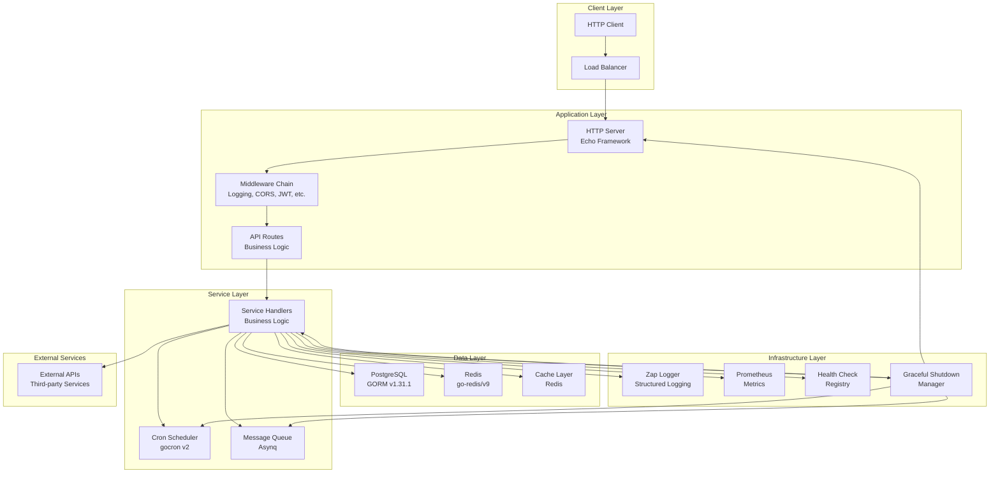
```mermaid
graph TB
    subgraph "Client Layer"
        CL[HTTP Client]
        LB[Load Balancer]
    end

    subgraph "Application Layer"
        HS[HTTP Server<br/>Echo Framework]
        MID[Middleware Chain<br/>Logging, CORS, JWT, etc.]
        API[API Routes<br/>Business Logic]
    end

    subgraph "Service Layer"
        CRN[Cron Scheduler<br/>gocron v2]
        MQ[Message Queue<br/>Asynq]
        SVC[Service Handlers<br/>Business Logic]
    end

    subgraph "Data Layer"
        PG[PostgreSQL<br/>GORM v1.31.1]
        RD[Redis<br/>go-redis/v9]
        CACHE[Cache Layer<br/>Redis]
    end

    subgraph "Infrastructure Layer"
        LOG[Zap Logger<br/>Structured Logging]
        MET[Prometheus<br/>Metrics]
        HC[Health Check<br/>Registry]
        GRACE[Graceful Shutdown<br/>Manager]
    end

    subgraph "External Services"
        EXT[External APIs<br/>Third-party Services]
    end

    CL --> LB
    LB --> HS

    HS --> MID
    MID --> API
    API --> SVC

    SVC --> CRN
    SVC --> MQ
    SVC --> PG
    SVC --> RD

    SVC --> CACHE

    SVC --> LOG
    SVC --> MET
    SVC --> HC
    SVC --> GRACE

    SVC --> EXT

    GRACE --> HS
    GRACE --> CRN
    GRACE --> MQ
    GRACE --> SVC
```

### 2. Architectural Principles

#### Clean Architecture Principles
- **Dependency Inversion**: High-level modules don't depend on low-level modules
- **Separation of Concerns**: Clear boundaries between different layers
- **Interface Segregation**: Small, focused interfaces with single responsibility
- **Open/Closed Principle**: Open for extension, closed for modification

#### Govern-Specific Principles
- **Graceful Shutdown**: All components must support graceful shutdown
- **Observability**: Built-in logging, metrics, and health checks
- **Configuration-Driven**: Behavior controlled through configuration
- **Production-Ready**: Components designed for production environments

### 3. Layer Responsibilities

#### Client Layer
- HTTP clients consuming the service
- Load balancers for horizontal scaling
- API gateway for routing and authentication

#### Application Layer
- HTTP server with Echo framework
- Middleware chain for cross-cutting concerns
- API routes and request handling

#### Service Layer
- Business logic and application services
- Background job scheduling
- Message processing and queue management
- Data access coordination

#### Data Layer
- PostgreSQL for persistent data
- Redis for caching and session storage
- Connection pooling and optimization

#### Infrastructure Layer
- Logging with structured output
- Metrics collection and monitoring
- Health checks and monitoring
- Lifecycle management

## Core Components

### 1. HTTP Server Architecture

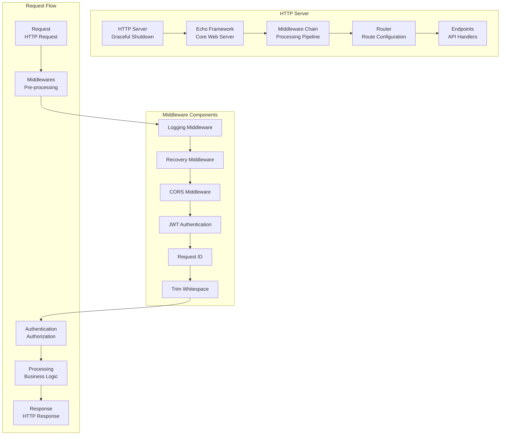
```mermaid
graph TB
    subgraph "HTTP Server"
        HS[HTTP Server<br/>Graceful Shutdown]
        ECHO[Echo Framework<br/>Core Web Server]
        MID[Middleware Chain<br/>Processing Pipeline]
        ROUT[Router<br/>Route Configuration]
        END[Endpoints<br/>API Handlers]
    end

    subgraph "Middleware Components"
        LOG[Logging Middleware]
        REC[Recovery Middleware]
        CORS[CORS Middleware]
        JWT[JWT Authentication]
        RID[Request ID]
        TRIM[Trim Whitespace]
    end

    subgraph "Request Flow"
        REQ[Request<br/>HTTP Request]
        PRE[Middlewares<br/>Pre-processing]
        AUTH[Authentication<br/>Authorization]
        PROC[Processing<br/>Business Logic]
        RESP[Response<br/>HTTP Response]
    end

    REQ --> PRE
    PRE --> LOG
    LOG --> REC
    REC --> CORS
    CORS --> JWT
    JWT --> RID
    RID --> TRIM
    TRIM --> AUTH
    AUTH --> PROC
    PROC --> RESP

    HS --> ECHO
    ECHO --> MID
    MID --> ROUT
    ROUT --> END
```

#### Key Components

**HTTP Server (`http/server.go`)**
- Main server with graceful shutdown
- Echo framework integration
- Configuration management
- Lifecycle management

**Middleware Chain (`http/middleware/`)**
- Logging middleware with structured output
- Recovery middleware with panic handling
- CORS middleware with configurable policies
- JWT authentication with multiple extractors
- Request ID tracking
- Request trimming

**Echo Integration (`http/echo/`)**
- Framework-specific utilities
- Swagger documentation support
- Handler wrapping and context helpers
- JWT authentication helpers

### 2. Configuration Management Architecture

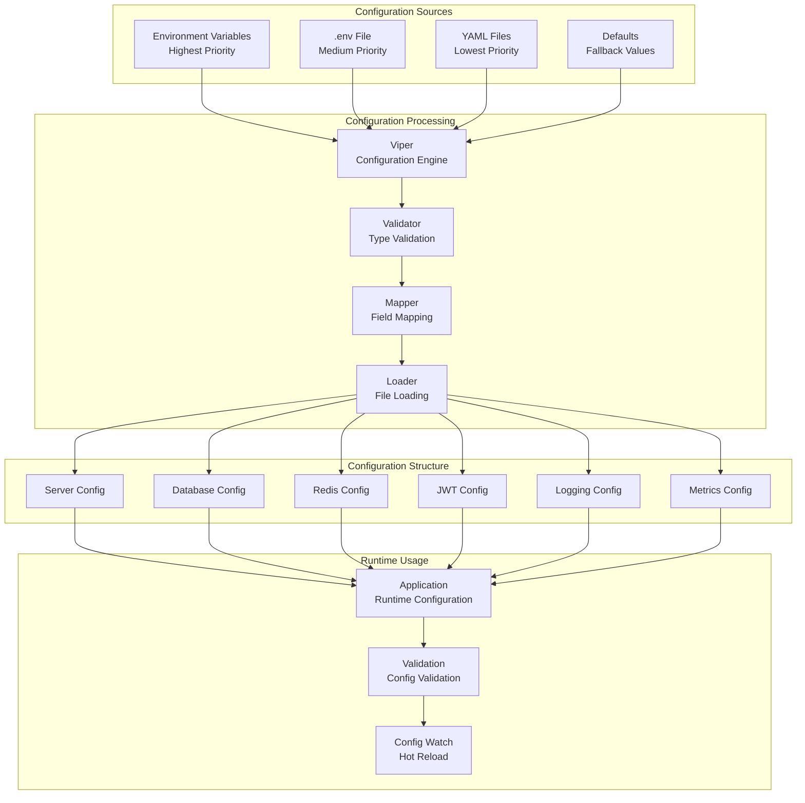
```mermaid
graph TB
    subgraph "Configuration Sources"
        ENV[Environment Variables<br/>Highest Priority]
        ENV_FILE[.env File<br/>Medium Priority]
        YAML[YAML Files<br/>Lowest Priority]
        DEF[Defaults<br/>Fallback Values]
    end

    subgraph "Configuration Processing"
        Viper[Viper<br/>Configuration Engine]
        Validator[Validator<br/>Type Validation]
        Mapper[Mapper<br/>Field Mapping]
        Loader[Loader<br/>File Loading]
    end

    subgraph "Configuration Structure"
        SERVER[Server Config]
        DB[Database Config]
        REDIS[Redis Config]
        JWT[JWT Config]
        LOG[Logging Config]
        MET[Metrics Config]
    end

    subgraph "Runtime Usage"
        APP[Application<br/>Runtime Configuration]
        VALID[Validation<br/>Config Validation]
        WATCH[Config Watch<br/>Hot Reload]
    end

    ENV --> Viper
    ENV_FILE --> Viper
    YAML --> Viper
    DEF --> Viper

    Viper --> Validator
    Validator --> Mapper
    Mapper --> Loader

    Loader --> SERVER
    Loader --> DB
    Loader --> REDIS
    Loader --> JWT
    Loader --> LOG
    Loader --> MET

    SERVER --> APP
    DB --> APP
    REDIS --> APP
    JWT --> APP
    LOG --> APP
    MET --> APP

    APP --> VALID
    VALID --> WATCH
```

#### Key Features

**Configuration Priority**
```go
// Priority: Environment Variables > .env file > YAML values > defaults
type Config struct {
    Server     ServerConfig     `mapstructure:"server" validate:"required"`
    Database   DatabaseConfig   `mapstructure:"database" validate:"required"`
    Redis      RedisConfig      `mapstructure:"redis" validate:"required"`
    JWT        JWTConfig        `mapstructure:"jwt" validate:"required"`
    Log        LogConfig        `mapstructure:"log" validate:"required"`
    Metrics    MetricsConfig    `mapstructure:"metrics" validate:"required"`
}
```

**Environment Variable Mapping**
```go
// Automatic dot-to-underscore mapping
// YAML: server.port -> Environment: SERVER_PORT
func LoadWithDefaults() (*Config, error) {
    viper.AutomaticEnv()
    viper.SetEnvKeyReplacer(strings.NewReplacer(".", "_"))

    // Load defaults, then override with env, then file
    viper.SetConfigFile("config.yaml")
    viper.ReadInConfig()

    var config Config
    if err := viper.Unmarshal(&config); err != nil {
        return nil, err
    }

    return &config, nil
}
```

### 3. Database Architecture

#### PostgreSQL Integration

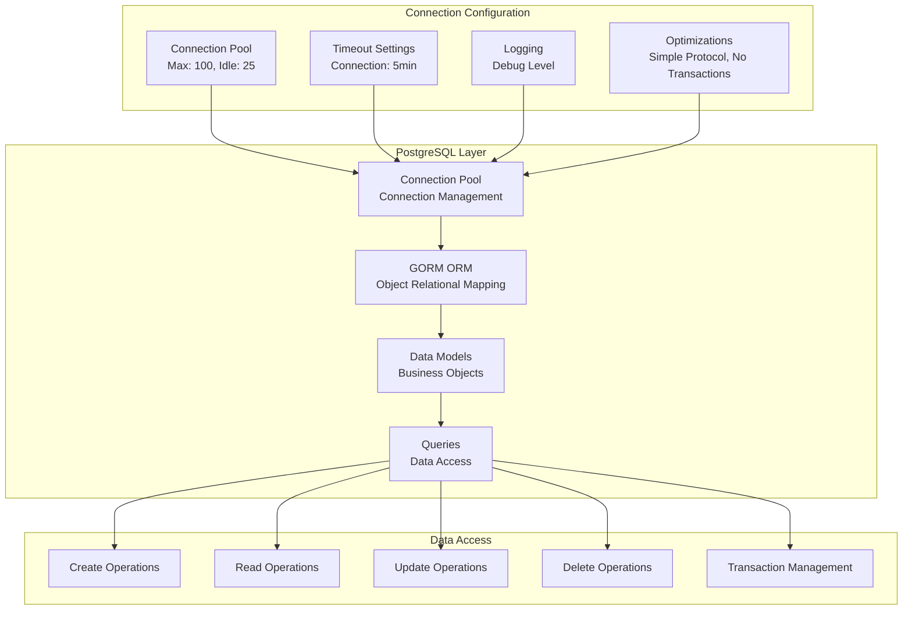
```mermaid
graph TB
    subgraph "PostgreSQL Layer"
        CONN[Connection Pool<br/>Connection Management]
        GORM[GORM ORM<br/>Object Relational Mapping]
        MODELS[Data Models<br/>Business Objects]
        QUERY[Queries<br/>Data Access]
    end

    subgraph "Connection Configuration"
        POOL[Connection Pool<br/>Max: 100, Idle: 25]
        TIMEOUT[Timeout Settings<br/>Connection: 5min]
        LOG[Logging<br/>Debug Level]
        OPT[Optimizations<br/>Simple Protocol, No Transactions]
    end

    subgraph "Data Access"
        CREATE[Create Operations]
        READ[Read Operations]
        UPDATE[Update Operations]
        DELETE[Delete Operations]
        TXN[Transaction Management]
    end

    CONN --> GORM
    GORM --> MODELS
    MODELS --> QUERY

    POOL --> CONN
    TIMEOUT --> CONN
    LOG --> CONN
    OPT --> CONN

    QUERY --> CREATE
    QUERY --> READ
    QUERY --> UPDATE
    QUERY --> DELETE
    QUERY --> TXN
```

#### Redis Integration

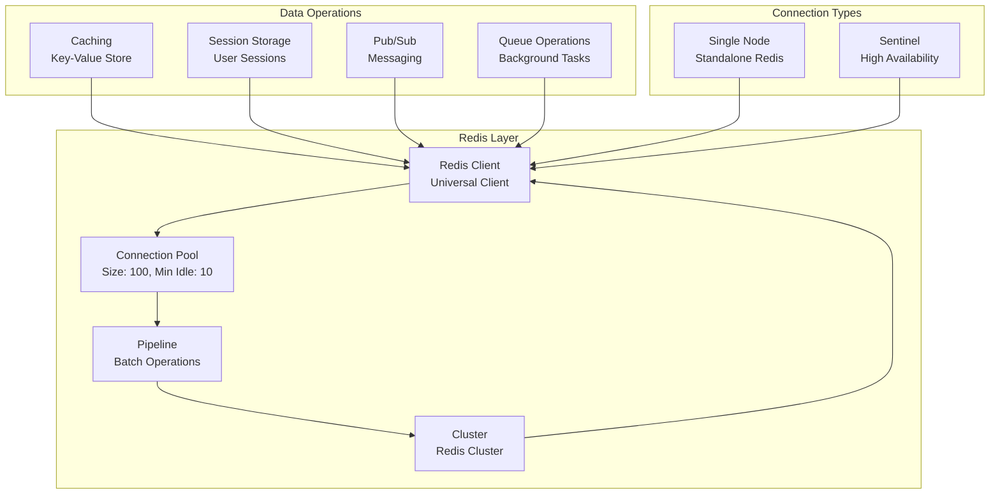
```mermaid
graph TB
    subgraph "Redis Layer"
        CLIENT[Redis Client<br/>Universal Client]
        POOL[Connection Pool<br/>Size: 100, Min Idle: 10]
        PIPELINE[Pipeline<br/>Batch Operations]
        CLUSTER[Cluster Support<br/>Multi-node]
    end

    subgraph "Data Operations"
        CACHE[Caching<br/>Key-Value Store]
        SESSION[Session Storage<br/>User Sessions]
        PUBSUB[Pub/Sub<br/>Messaging]
        QUEUE[Queue Operations<br/>Background Tasks]
    end

    subgraph "Connection Types"
        SINGLE[Single Node<br/>Standalone Redis]
        CLUSTER[Cluster<br/>Redis Cluster]
        SENTINEL[Sentinel<br/>High Availability]
    end

    CLIENT --> POOL
    POOL --> PIPELINE
    PIPELINE --> CLUSTER

    CACHE --> CLIENT
    SESSION --> CLIENT
    PUBSUB --> CLIENT
    QUEUE --> CLIENT

    SINGLE --> CLIENT
    CLUSTER --> CLIENT
    SENTINEL --> CLIENT
```

### 4. Message Queue Architecture

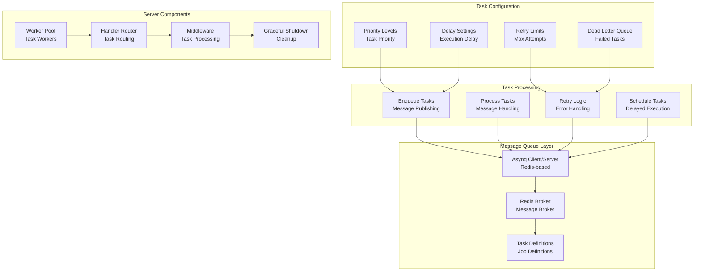
```mermaid
graph TB
    subgraph "Message Queue Layer"
        ASYNQ[Asynq Client/Server<br/>Redis-based]
        BROKER[Redis Broker<br/>Message Broker]
        TASK[Task Definitions<br/>Job Definitions]
    end

    subgraph "Task Processing"
        ENQUEUE[Enqueue Tasks<br/>Message Publishing]
        PROCESS[Process Tasks<br<arg_value>
Message Handling]
        RETRY[Retry Logic<br/>Error Handling]
        SCHEDULE[Schedule Tasks<br/>Delayed Execution]
    end

    subgraph "Task Configuration"
        PRIORITY[Priority Levels<br/>Task Priority]
        DELAY[Delay Settings<br/>Execution Delay]
        MAX_RETRIES[Retry Limits<br/>Max Attempts]
        DEADLETTER[Dead Letter Queue<br/>Failed Tasks]
    end

    subgraph "Server Components"
        WORKER[Worker Pool<br/>Task Workers]
        MUX[Handler Router<br/>Task Routing]
        MIDWARE[Middleware<br/>Task Processing]
        GRACE[Graceful Shutdown<br/>Cleanup]
    end

    ASYNQ --> BROKER
    BROKER --> TASK

    ENQUEUE --> ASYNQ
    PROCESS --> ASYNQ
    RETRY --> ASYNQ
    SCHEDULE --> ASYNQ

    PRIORITY --> ENQUEUE
    DELAY --> ENQUEUE
    MAX_RETRIES --> RETRY
    DEADLETTER --> RETRY

    WORKER --> MUX
    MUX --> MIDWARE
    MIDWARE --> GRACE
```

#### Key Features

**Task Enqueueing**
```go
// Enqueue tasks with priority, retry, and scheduling
func (c *Client) Enqueue(task *asynq.Task, opts ...asynq.Option) (*asynq.Result, error) {
    // Priority configuration
    if priority > 0 {
        opts = append(opts, asynq.Queue(fmt.Sprintf("priority-%d", priority)))
    }

    // Retry configuration
    if maxRetries > 0 {
        opts = append(opts, asynq.MaxRetry(maxRetries))
    }

    // Delay configuration
    if delay > 0 {
        opts = append(opts, asynq.ProcessAt(time.Now().Add(delay)))
    }

    return c.client.Enqueue(task, opts...)
}
```

**Server Processing**
```go
// Task processing with graceful shutdown
func (s *Server) Start() error {
    // Configure server
    s.server = asynq.NewServer(s.redis, asynq.Config{
        Concurrency: s.config.Concurrency,
        ShutdownTimeout: s.config.ShutdownTimeout,
    })

    // Start processing
    mux := asynq.NewServeMux()
    mux.HandleFunc(taskType, s.processTask)

    return s.server.Run(mux)
}
```

### 5. Observability Architecture

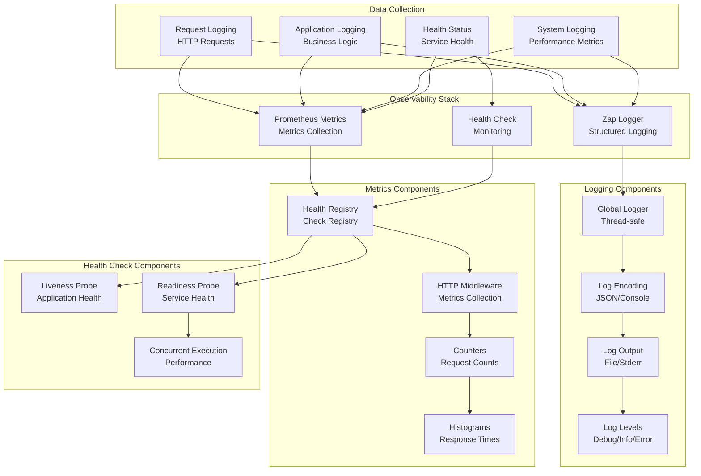
```mermaid
graph TB
    subgraph "Observability Stack"
        LOG[Zap Logger<br/>Structured Logging]
        MET[Prometheus Metrics<br/>Metrics Collection]
        HC[Health Check<br/>Monitoring]
    end

    subgraph "Logging Components"
        LOGGER[Global Logger<br/>Thread-safe]
        ENCODER[Log Encoding<br/>JSON/Console]
        OUTPUT[Log Output<br/>File/Stderr]
        LEVELS[Log Levels<br/>Debug/Info/Error]
    end

    subgraph "Metrics Components"
        REGISTRY[Metrics Registry<br/>Prometheus]
        HTTP_MID[HTTP Middleware<br/>Metrics Collection]
        COUNTER[Counters<br/>Request Counts]
        HISTOGRAM[Histograms<br/>Response Times]
    end

    subgraph "Health Check Components"
        REGISTRY[Health Registry<br/>Check Registry]
        LIVE[Liveness Probe<br/>Application Health]
        READY[Readiness Probe<br/>Service Health]
        CONCURRENT[Concurrent Execution<br/>Performance]
    end

    subgraph "Data Collection"
        REQ_LOG[Request Logging<br/>HTTP Requests]
        APP_LOG[Application Logging<br<arg_value>
Business Logic]
        SYS_LOG[System Logging<br<arg_value>
Performance Metrics]
        HEALTH[Health Status<br/>Service Health]
    end

    REQ_LOG --> LOG
    APP_LOG --> LOG
    SYS_LOG --> LOG
    HEALTH --> HC

    REQ_LOG --> MET
    APP_LOG --> MET
    SYS_LOG --> MET
    HEALTH --> MET

    LOG --> LOGGER
    LOGGER --> ENCODER
    ENCODER --> OUTPUT
    OUTPUT --> LEVELS

    MET --> REGISTRY
    REGISTRY --> HTTP_MID
    HTTP_MID --> COUNTER
    COUNTER --> HISTOGRAM

    HC --> REGISTRY
    REGISTRY --> LIVE
    REGISTRY --> READY
    READY --> CONCURRENT
```

#### Key Features

**Structured Logging**
```go
// Zap-based structured logging
func (l *Logger) LogRequest(c echo.Context, start time.Duration) {
    l.logger.Info("Request processed",
        zap.String("method", c.Request().Method),
        zap.String("path", c.Request().URL.Path),
        zap.String("remote_addr", c.Request().RemoteAddr),
        zap.Duration("duration", start),
        zap.String("user_agent", c.Request().UserAgent()),
    )
}
```

**Metrics Collection**
```go
// Prometheus metrics middleware
func MetricsMiddleware(registry *prometheus.Registry) echo.MiddlewareFunc {
    return func(next echo.HandlerFunc) echo.HandlerFunc {
        return func(c echo.Context) error {
            start := time.Now()

            // Process request
            err := next(c)

            // Record metrics
            duration := time.Since(start)

            registry.HTTPRequestsTotal.WithLabelValues(
                c.Request().Method,
                c.Path(),
                strconv.Itoa(c.Response().Status),
            ).Inc()

            registry.HTTPRequestDuration.WithLabelValues(
                c.Request().Method,
                c.Path(),
            ).Observe(duration.Seconds())

            return err
        }
    }
}
```

### 6. Graceful Shutdown Architecture

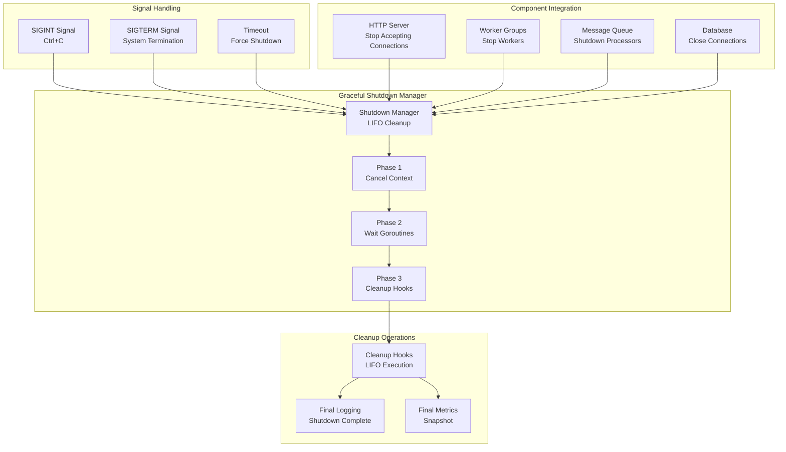
```mermaid
graph TB
    subgraph "Graceful Shutdown Manager"
        MANAGER[Shutdown Manager<br/>LIFO Cleanup]
        PHASE_1[Phase 1<br/>Cancel Context]
        PHASE_2[Phase 2<br/>Wait Goroutines]
        PHASE_3[Phase 3<br/>Cleanup Hooks]
    end

    subgraph "Component Integration"
        HTTP[HTTP Server<br/>Stop Accepting Connections]
        WORKERS[Worker Groups<br<arg_value>
Stop Workers]
        QUEUES[Message Queue<br/>Shutdown Processors]
        DATABASES[Database<br<arg_value>
Close Connections]
    end

    subgraph "Signal Handling"
        SIGINT[SIGINT Signal<br/>Ctrl+C]
        SIGTERM[SIGTERM Signal<br<arg_value>
System Termination]
        TIMEOUT[Timeout<br/>Force Shutdown]
    end

    subgraph "Cleanup Operations"
        HOOKS[Cleanup Hooks<br/>LIFO Execution]
        LOGGING[Final Logging<br/>Shutdown Complete]
        METRICS[Final Metrics<br/>Snapshot]
    end

    SIGINT --> MANAGER
    SIGTERM --> MANAGER
    TIMEOUT --> MANAGER

    MANAGER --> PHASE_1
    PHASE_1 --> PHASE_2
    PHASE_2 --> PHASE_3
    PHASE_3 --> HOOKS

    HTTP --> MANAGER
    WORKERS --> MANAGER
    QUEUES --> MANAGER
    DATABASES --> MANAGER

    HOOKS --> LOGGING
    HOOKS --> METRICS
```

#### Key Features

**Three-Phase Shutdown**
```go
// Three-phase shutdown pattern
func (m *Manager) Shutdown() {
    // Phase 1: Cancel context
    m.cancel()

    // Phase 2: Wait for goroutines
    m.shutdownWG.Wait()

    // Phase 3: Cleanup hooks (LIFO)
    for i := len(m.cleanupHooks) - 1; i >= 0; i-- {
        hook := m.cleanupHooks[i]
        if err := hook(); err != nil {
            m.logger.Error("Cleanup hook failed", zap.Error(err))
        }
    }
}
```

## Integration Patterns

### 1. Dependency Injection Pattern

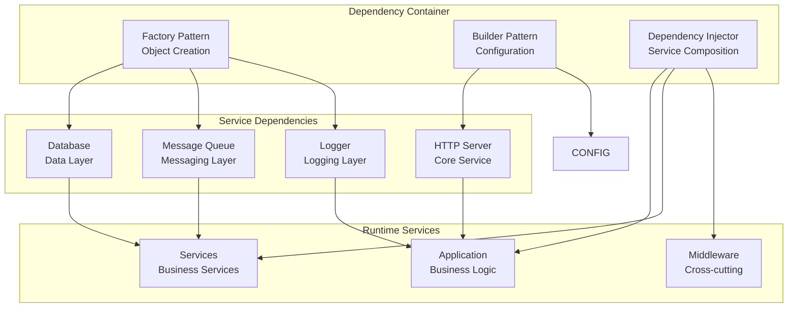
```mermaid
graph TB
    subgraph "Dependency Container"
        FACTORY[Factory Pattern<br/>Object Creation]
        BUILDER[Builder Pattern<br<arg_value>
Configuration]
        INJECTOR[Dependency Injector<br/>Service Composition]
    end

    subgraph "Service Dependencies"
        HTTP[HTTP Server<br/>Core Service]
        DB[Database<br/>Data Layer]
        MQ[Message Queue<br<arg_value>
Messaging Layer]
        LOG[Logger<br/>Logging Layer]
    end

    subgraph "Runtime Services"
        APP[Application<br/>Business Logic]
        SVC[Services<br<arg_value>
Business Services]
        MIDWARE[Middleware<br<arg_value>
Cross-cutting]
    end

    FACTORY --> DB
    FACTORY --> MQ
    FACTORY --> LOG

    BUILDER --> HTTP
    BUILDER --> CONFIG

    INJECTOR --> APP
    INJECTOR --> SVC
    INJECTOR --> MIDWARE

    HTTP --> APP
    DB --> SVC
    MQ --> SVC
    LOG --> APP
```

#### Implementation Example

```go
// Service factory with dependency injection
type ServiceFactory struct {
    config    *config.Config
    logger    *zap.Logger
    database  *gorm.DB
    redis     *redis.Client
    queue     *asynq.Client
}

func (f *ServiceFactory) NewHTTPServer() *http.Server {
    return &http.Server{
        Config:     f.config.Server,
        Logger:     f.logger,
        Database:   f.database,
        Redis:      f.redis,
        Queue:      f.queue,
    }
}

func (f *ServiceFactory) NewService() *Service {
    return &Service{
        database: f.database,
        redis:    f.redis,
        queue:    f.queue,
        logger:   f.logger,
    }
}
```

### 2. Middleware Chain Pattern

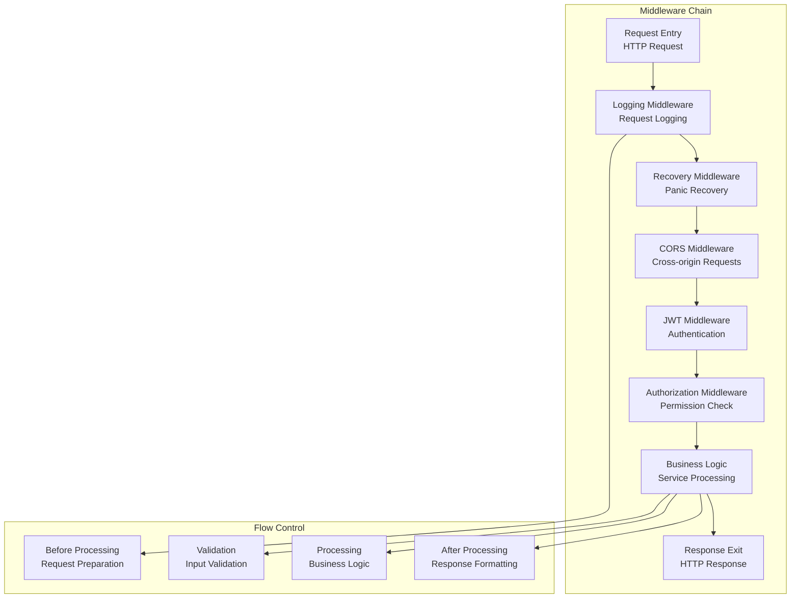
```mermaid
graph TB
    subgraph "Middleware Chain"
        ENTRY[Request Entry<br/>HTTP Request]
        LOG[Logging Middleware<br/>Request Logging]
        REC[Recovery Middleware<br<arg_value>
Panic Recovery]
        CORS[CORS Middleware<br/>Cross-origin Requests]
        JWT[JWT Middleware<br/>Authentication]
        AUTH[Authorization Middleware<br/>Permission Check]
        BUSINESS[Business Logic<br/>Service Processing]
        EXIT[Response Exit<br/>HTTP Response]
    end

    subgraph "Flow Control"
        BEFORE[Before Processing<br<arg_value>
Request Preparation]
        VALIDATE[Validation<br/>Input Validation]
        PROCESS[Processing<br<arg_value>
Business Logic]
        AFTER[After Processing<br/>Response Formatting]
    end

    ENTRY --> LOG
    LOG --> REC
    REC --> CORS
    CORS --> JWT
    JWT --> AUTH
    AUTH --> BUSINESS
    BUSINESS --> EXIT

    LOG --> BEFORE
    BUSINESS --> VALIDATE
    BUSINESS --> PROCESS
    BUSINESS --> AFTER
```

#### Implementation Example

```go
// Middleware chain implementation
func Chain(middlewares ...echo.MiddlewareFunc) echo.MiddlewareFunc {
    return func(next echo.HandlerFunc) echo.HandlerFunc {
        return func(c echo.Context) error {
            // Reverse order for chaining
            for i := len(middlewares) - 1; i >= 0; i-- {
                next = middlewares[i](next)
            }
            return next(c)
        }
    }
}

// Usage example
func setupMiddleware() echo.MiddlewareFunc {
    return Chain(
        LoggingMiddleware,
        RecoveryMiddleware,
        CORSMiddleware,
        JWTMiddleware,
        AuthorizationMiddleware,
    )
}
```

### 3. Repository Pattern

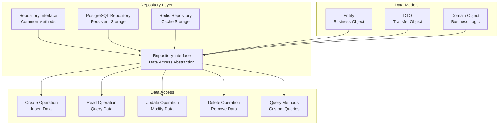
```mermaid
graph TB
    subgraph "Repository Layer"
        REPO[Repository Interface<br/>Data Access Abstraction]
        POSTGRES[PostgreSQL Repository<br/>Persistent Storage]
        REDIS[Redis Repository<br<arg_value>
Cache Storage]
        INTERFACE[Repository Interface<br<arg_value>
Common Methods]
    end

    subgraph "Data Models"
        ENTITY[Entity<br/>Business Object]
        DTO[DTO<br/>Transfer Object]
        DOMAIN[Domain Object<br/>Business Logic]
    end

    subgraph "Data Access"
        CREATE[Create Operation<br/>Insert Data]
        READ[Read Operation<br/>Query Data]
        UPDATE[Update Operation<br/>Modify Data]
        DELETE[Delete Operation<br/>Remove Data]
        QUERY[Query Methods<br<arg_value>
Custom Queries]
    end

    INTERFACE --> REPO
    POSTGRES --> REPO
    REDIS --> REPO

    REPO --> CREATE
    REPO --> READ
    REPO --> UPDATE
    REPO --> DELETE
    REPO --> QUERY

    ENTITY --> REPO
    DTO --> REPO
    DOMAIN --> REPO
```

#### Implementation Example

```go
// Repository interface
type UserRepository interface {
    Create(user *User) error
    GetByID(id string) (*User, error)
    GetByEmail(email string) (*User, error)
    Update(user *User) error
    Delete(id string) error
}

// PostgreSQL repository implementation
type PostgresUserRepository struct {
    db *gorm.DB
}

func (r *PostgresUserRepository) Create(user *User) error {
    return r.db.Create(user).Error
}

func (r *PostgresUserRepository) GetByID(id string) (*User, error) {
    var user User
    err := r.db.First(&user, id).Error
    if err != nil {
        return nil, err
    }
    return &user, nil
}
```

## Design Patterns

### 1. Builder Pattern

**Usage**: Configuration and object construction

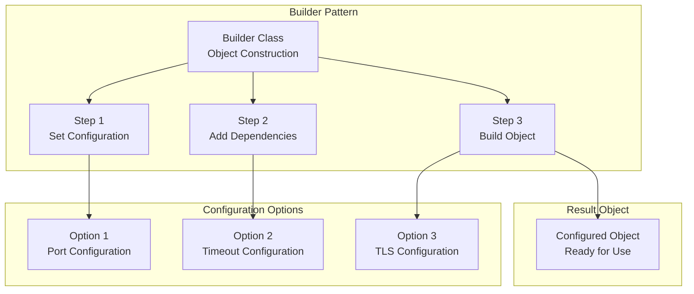
```mermaid
graph TB
    subgraph "Builder Pattern"
        BUILDER[Builder Class<br/>Object Construction]
        STEP_1[Step 1<br/>Set Configuration]
        STEP_2[Step 2<br<arg_value>
Add Dependencies]
        STEP_3[Step 3<br/>Build Object]
    end

    subgraph "Configuration Options"
        OPTION_1[Option 1<br/>Port Configuration]
        OPTION_2[Option 2<br<arg_value>
Timeout Configuration]
        OPTION_3[Option 3<br<arg_value>
TLS Configuration]
    end

    subgraph "Result Object"
        RESULT[Configured Object<br/>Ready for Use]
    end

    BUILDER --> STEP_1
    BUILDER --> STEP_2
    BUILDER --> STEP_3

    STEP_1 --> OPTION_1
    STEP_2 --> OPTION_2
    STEP_3 --> OPTION_3

    STEP_3 --> RESULT
```

#### Implementation Example

```go
// Server configuration builder
type ServerBuilder struct {
    config config.ServerConfig
    logger *zap.Logger
    graceful *graceful.Manager
}

func NewServerBuilder() *ServerBuilder {
    return &ServerBuilder{
        config: config.ServerConfig{
            Port:        8080,
            ReadTimeout: 30 * time.Second,
            WriteTimeout: 30 * time.Second,
        },
    }
}

func (b *ServerBuilder) WithPort(port int) *ServerBuilder {
    b.config.Port = port
    return b
}

func (b *ServerBuilder) WithLogger(logger *zap.Logger) *ServerBuilder {
    b.logger = logger
    return b
}

func (b *ServerBuilder) Build() (*Server, error) {
    return NewServer(b.config)
}
```

### 2. Strategy Pattern

**Usage**: Algorithm selection and configuration

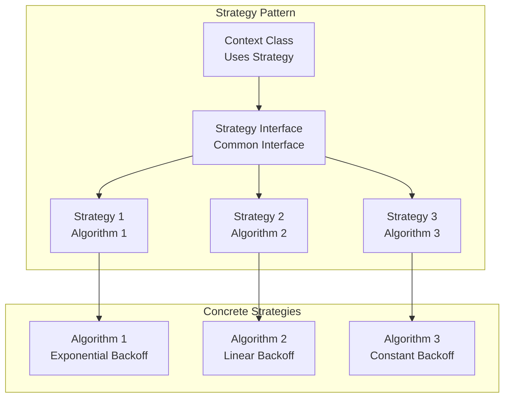
```mermaid
graph TB
    subgraph "Strategy Pattern"
        CONTEXT[Context Class<br<arg_value>
Uses Strategy]
        STRATEGY[Strategy Interface<br/>Common Interface]
        STRATEGY_1[Strategy 1<br/>Algorithm 1]
        STRATEGY_2[Strategy 2<br/>Algorithm 2]
        STRATEGY_3[Strategy 3<br/>Algorithm 3]
    end

    subgraph "Concrete Strategies"
        ALG_1[Algorithm 1<br/>Exponential Backoff]
        ALG_2[Algorithm 2<br/>Linear Backoff]
        ALG_3[Algorithm 3<br/>Constant Backoff]
    end

    CONTEXT --> STRATEGY
    STRATEGY --> STRATEGY_1
    STRATEGY --> STRATEGY_2
    STRATEGY --> STRATEGY_3

    STRATEGY_1 --> ALG_1
    STRATEGY_2 --> ALG_2
    STRATEGY_3 --> ALG_3
```

#### Implementation Example

```go
// Retry strategy interface
type RetryStrategy interface {
    Next(attempt int, err error) time.Duration
}

// Exponential backoff strategy
type ExponentialBackoff struct {
    InitialDelay time.Duration
    MaxDelay     time.Duration
    Multiplier   float64
    Jitter       float64
}

func (e *ExponentialBackoff) Next(attempt int, err error) time.Duration {
    delay := float64(e.InitialDelay) * math.Pow(e.Multiplier, float64(attempt-1))
    if delay > float64(e.MaxDelay) {
        delay = float64(e.MaxDelay)
    }

    // Add jitter
    jitter := delay * e.Jitter * (2*rand.Float64() - 1)
    delay = math.Max(0, delay+jitter)

    return time.Duration(delay)
}

// Retry context
type RetryContext struct {
    Strategy RetryStrategy
    MaxAttempts int
}

func (r *RetryContext) Execute(fn func() error) error {
    var lastErr error

    for attempt := 1; attempt <= r.MaxAttempts; attempt++ {
        err := fn()
        if err == nil {
            return nil
        }

        lastErr = err

        // Check if we should retry
        if !shouldRetry(err) {
            return err
        }

        // Wait before retry
        delay := r.Strategy.Next(attempt, err)
        time.Sleep(delay)
    }

    return fmt.Errorf("max retries exceeded: %w", lastErr)
}
```

### 3. Observer Pattern

**Usage**: Event handling and notification

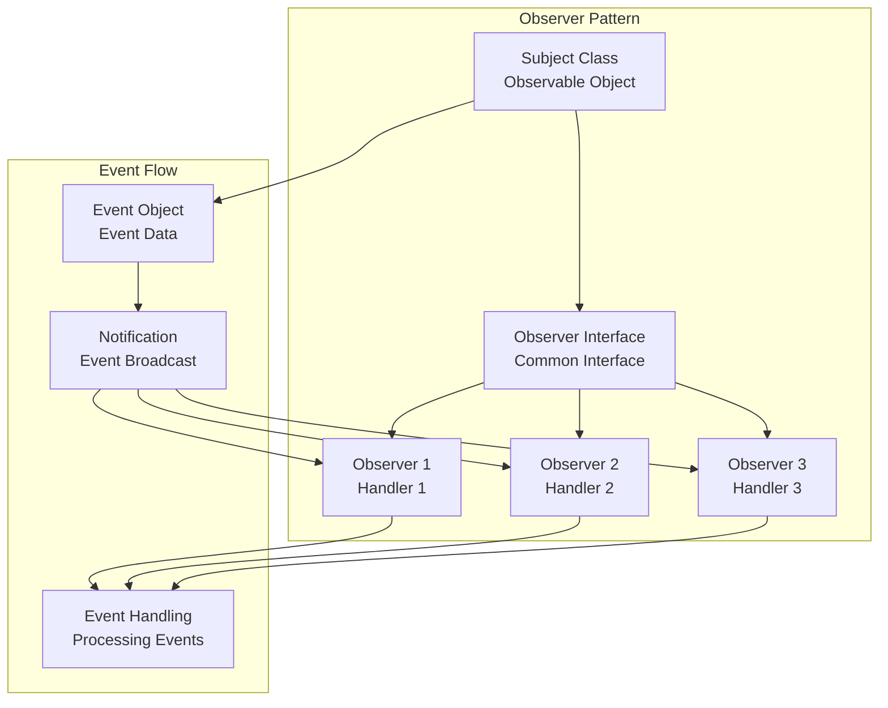
```mermaid
graph TB
    subgraph "Observer Pattern"
        SUBJECT[Subject Class<br/>Observable Object]
        OBSERVER[Observer Interface<br/>Common Interface]
        OBSERVER_1[Observer 1<br/>Handler 1]
        OBSERVER_2[Observer 2<br/>Handler 2]
        OBSERVER_3[Observer 3<br/>Handler 3]
    end

    subgraph "Event Flow"
        EVENT[Event Object<br/>Event Data]
        NOTIFICATION[Notification<br/>Event Broadcast]
        HANDLING[Event Handling<br<arg_value>
Processing Events]
    end

    SUBJECT --> OBSERVER
    OBSERVER --> OBSERVER_1
    OBSERVER --> OBSERVER_2
    OBSERVER --> OBSERVER_3

    SUBJECT --> EVENT
    EVENT --> NOTIFICATION
    NOTIFICATION --> OBSERVER_1
    NOTIFICATION --> OBSERVER_2
    NOTIFICATION --> OBSERVER_3

    OBSERVER_1 --> HANDLING
    OBSERVER_2 --> HANDLING
    OBSERVER_3 --> HANDLING
```

#### Implementation Example

```go
// Health check subject
type HealthCheckSubject struct {
    observers []HealthCheckObserver
    mutex     sync.RWMutex
}

// Health check observer interface
type HealthCheckObserver interface {
    OnHealthUpdate(check HealthCheck)
}

// Register observer
func (s *HealthCheckSubject) Register(observer HealthCheckObserver) {
    s.mutex.Lock()
    defer s.mutex.Unlock()
    s.observers = append(s.observers, observer)
}

// Notify observers
func (s *HealthCheckSubject) Notify(check HealthCheck) {
    s.mutex.RLock()
    defer s.mutex.RUnlock()

    for _, observer := range s.observers {
        observer.OnHealthUpdate(check)
    }
}

// Health check observer implementation
type LoggingObserver struct {
    logger *zap.Logger
}

func (l *LoggingObserver) OnHealthUpdate(check HealthCheck) {
    l.logger.Info("Health check update",
        zap.String("name", check.Name),
        zap.String("status", string(check.Status)),
        zap.Duration("duration", check.Duration),
        zap.String("message", check.Message),
    )
}
```

### 4. Factory Pattern

**Usage**: Object creation with different implementations

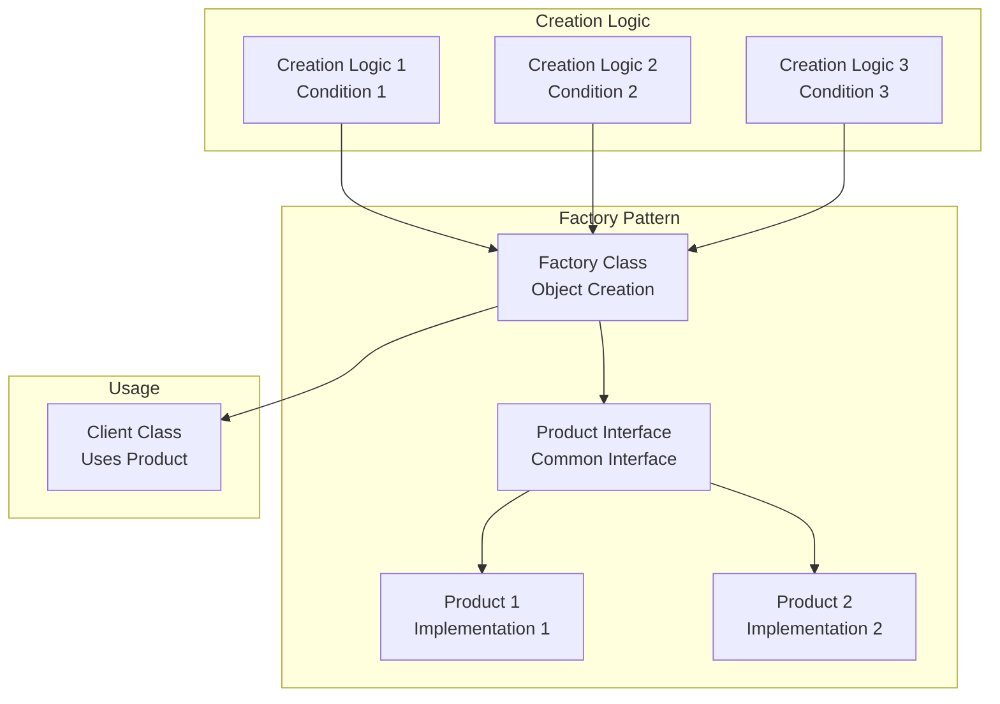
```mermaid
graph TB
    subgraph "Factory Pattern"
        FACTORY[Factory Class<br/>Object Creation]
        PRODUCT[Product Interface<br/>Common Interface]
        PRODUCT_1[Product 1<br/>Implementation 1]
        PRODUCT_2[Product 2<br/>Implementation 2]
    end

    subgraph "Creation Logic"
        CREATION_1[Creation Logic 1<br/>Condition 1]
        CREATION_2[Creation Logic 2<br/>Condition 2]
        CREATION_3[Creation Logic 3<br/>Condition 3]
    end

    subgraph "Usage"
        CLIENT[Client Class<br<arg_value>
Uses Product]
    end

    FACTORY --> PRODUCT
    PRODUCT --> PRODUCT_1
    PRODUCT --> PRODUCT_2

    CREATION_1 --> FACTORY
    CREATION_2 --> FACTORY
    CREATION_3 --> FACTORY

    FACTORY --> CLIENT
```

#### Implementation Example

```go
// Database factory
type DatabaseFactory struct {
    config *config.Config
}

// Database interface
type Database interface {
    GetConnection() *gorm.DB
    Close() error
}

// PostgreSQL implementation
type PostgresDatabase struct {
    db *gorm.DB
}

func (p *PostgresDatabase) GetConnection() *gorm.DB {
    return p.db
}

func (p *PostgresDatabase) Close() error {
    sqlDB, _ := p.db.DB()
    return sqlDB.Close()
}

// Redis implementation
type RedisDatabase struct {
    client *redis.Client
}

func (r *RedisDatabase) GetConnection() *redis.Client {
    return r.client
}

func (r *RedisDatabase) Close() error {
    return r.client.Close()
}

// Factory method
func (f *DatabaseFactory) NewDatabase() (Database, error) {
    if f.config.Database.Type == "postgres" {
        return f.createPostgres()
    } else if f.config.Database.Type == "redis" {
        return f.createRedis()
    }
    return nil, fmt.Errorf("unsupported database type")
}

func (f *DatabaseFactory) createPostgres() (*PostgresDatabase, error) {
    // Create PostgreSQL connection
    db, err := gorm.Open(postgres.Open(f.config.Database.DSN), &gorm.Config{})
    if err != nil {
        return nil, err
    }

    return &PostgresDatabase{db: db}, nil
}

func (f *DatabaseFactory) createRedis() (*RedisDatabase, error) {
    // Create Redis connection
    client := redis.NewClient(&redis.Options{
        Addr: f.config.Redis.Addr,
    })

    return &RedisDatabase{client: client}, nil
}
```

## Scalability Considerations

### 1. Horizontal Scaling

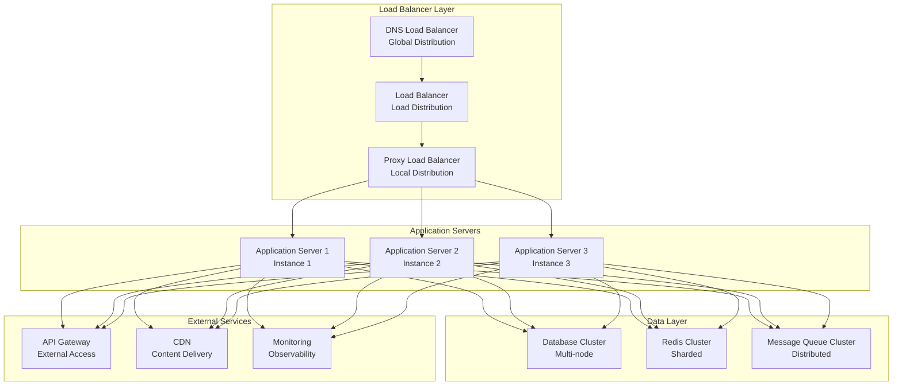
```mermaid
graph TB
    subgraph "Load Balancer Layer"
        LB[Load Balancer<br/>Load Distribution]
        DNS[DNS Load Balancer<br/>Global Distribution]
        PROXY[Proxy Load Balancer<br/>Local Distribution]
    end

    subgraph "Application Servers"
        APP_1[Application Server 1<br/>Instance 1]
        APP_2[Application Server 2<br/>Instance 2]
        APP_3[Application Server 3<br/>Instance 3]
    end

    subgraph "Data Layer"
        CLUSTER[Database Cluster<br/>Multi-node]
        REDIS_CLUSTER[Redis Cluster<br/>Sharded]
        MQ_CLUSTER[Message Queue Cluster<br/>Distributed]
    end

    subgraph "External Services"
        API_GATEWAY[API Gateway<br/>External Access]
        CDN[CDN<br/>Content Delivery]
        MONITORING[Monitoring<br<arg_value>
Observability]
    end

    DNS --> LB
    LB --> PROXY

    PROXY --> APP_1
    PROXY --> APP_2
    PROXY --> APP_3

    APP_1 --> CLUSTER
    APP_2 --> CLUSTER
    APP_3 --> CLUSTER

    APP_1 --> REDIS_CLUSTER
    APP_2 --> REDIS_CLUSTER
    APP_3 --> REDIS_CLUSTER

    APP_1 --> MQ_CLUSTER
    APP_2 --> MQ_CLUSTER
    APP_3 --> MQ_CLUSTER

    APP_1 --> API_GATEWAY
    APP_2 --> API_GATEWAY
    APP_3 --> API_GATEWAY

    APP_1 --> CDN
    APP_2 --> CDN
    APP_3 --> CDN

    APP_1 --> MONITORING
    APP_2 --> MONITORING
    APP_3 --> MONITORING
```

#### Key Scaling Strategies

**Stateless Application Design**
```go
// Design applications to be stateless
// Session state should be externalized
type Application struct {
    database *gorm.DB     // External state
    redis    *redis.Client  // External state
    queue    *asynq.Client // External state
    logger   *zap.Logger   // Stateless
}

func (a *Application) ProcessRequest(c echo.Context) error {
    // Don't store state in the application
    // Use external storage for session state
    return nil
}
```

**Connection Pooling**
```go
// Configure connection pooling for scalability
func createScalableConnection() {
    // PostgreSQL connection pooling
    sqlDB.SetMaxOpenConns(100)      // Maximum connections
    sqlDB.SetMaxIdleConns(25)       // Idle connections
    sqlDB.SetConnMaxLifetime(5 * time.Minute) // Connection lifetime

    // Redis connection pooling
    redisClient := redis.NewClient(&redis.Options{
        PoolSize:     100,         // Connection pool size
        MinIdleConns: 10,         // Minimum idle connections
        MaxRetries:   3,          // Retry attempts
    })
}
```

### 2. Caching Strategy

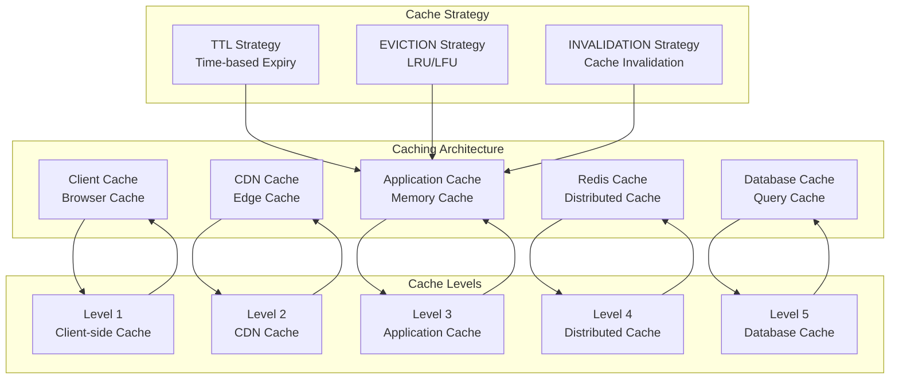
```mermaid
graph TB
    subgraph "Caching Architecture"
        CLIENT[Client Cache<br/>Browser Cache]
        CDN[CDN Cache<br<arg_value>
Edge Cache]
        CACHE[Application Cache<br/>Memory Cache]
        REDIS[Redis Cache<br/>Distributed Cache]
        DB[Database Cache<br/>Query Cache]
    end

    subgraph "Cache Levels"
        L1[Level 1<br/>Client-side Cache]
        L2[Level 2<br/>CDN Cache]
        L3[Level 3<br/>Application Cache]
        L4[Level 4<br<arg_value>
Distributed Cache]
        L5[Level 5<br/>Database Cache]
    end

    subgraph "Cache Strategy"
        TTL[TTL Strategy<br/>Time-based Expiry]
        EVICTION[EVICTION Strategy<br<arg_value>
LRU/LFU]
        INVALIDATION[INVALIDATION Strategy<br/>Cache Invalidation]
    end

    CLIENT --> L1
    CDN --> L2
    CACHE --> L3
    REDIS --> L4
    DB --> L5

    L1 --> CLIENT
    L2 --> CDN
    L3 --> CACHE
    L4 --> REDIS
    L5 --> DB

    TTL --> CACHE
    EVICTION --> CACHE
    INVALIDATION --> CACHE
```

#### Implementation Example

```go
// Cache interface for different caching strategies
type Cache interface {
    Get(key string) (interface{}, error)
    Set(key string, value interface{}, ttl time.Duration) error
    Delete(key string) error
    Clear() error
}

// Redis cache implementation
type RedisCache struct {
    client *redis.Client
}

func (r *RedisCache) Get(key string) (interface{}, error) {
    val, err := r.client.Get(ctx, key).Result()
    if err == redis.Nil {
        return nil, ErrCacheNotFound
    }
    return val, err
}

func (r *RedisCache) Set(key string, value interface{}, ttl time.Duration) error {
    return r.client.Set(ctx, key, value, ttl).Err()
}

// Cache middleware for HTTP
func CacheMiddleware(cache Cache, ttl time.Duration) echo.MiddlewareFunc {
    return func(next echo.HandlerFunc) echo.HandlerFunc {
        return func(c echo.Context) error {
            // Generate cache key from request
            key := generateCacheKey(c.Request())

            // Try to get from cache
            if cached, err := cache.Get(key); err == nil {
                return c.JSON(http.StatusOK, cached)
            }

            // Process request
            result := next(c)

            // Cache the result
            if c.Response().Status == http.StatusOK {
                cache.Set(key, c.Response().Data, ttl)
            }

            return result
        }
    }
}
```

### 3. Microservices Architecture

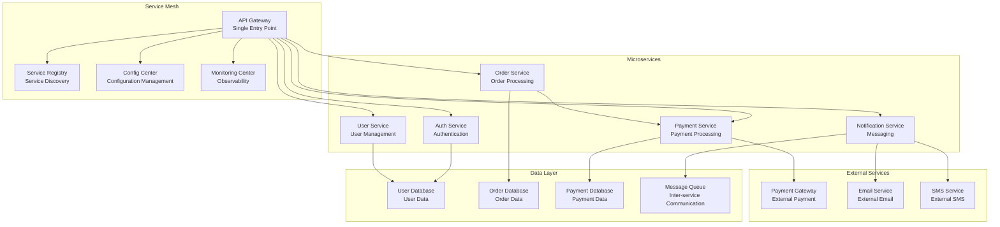
```mermaid
graph TB
    subgraph "Service Mesh"
        API_GATEWAY[API Gateway<br/>Single Entry Point]
        SERVICE_REGISTRY[Service Registry<br<arg_value>
Service Discovery]
        CONFIG_CENTER[Config Center<br/>Configuration Management]
        MONITORING_CENTER[Monitoring Center<br<arg_value>
Observability]
    end

    subgraph "Microservices"
        AUTH_SERVICE[Auth Service<br/>Authentication]
        USER_SERVICE[User Service<br/>User Management]
        ORDER_SERVICE[Order Service<br/>Order Processing]
        PAYMENT_SERVICE[Payment Service<br/>Payment Processing]
        NOTIFICATION_SERVICE[Notification Service<br/>Messaging]
    end

    subgraph "Data Layer"
        USER_DB[User Database<br/>User Data]
        ORDER_DB[Order Database<br/>Order Data]
        PAYMENT_DB[Payment Database<br/>Payment Data]
        MESSAGE_QUEUE[Message Queue<br/>Inter-service Communication]
    end

    subgraph "External Services"
        PAYMENT_GATEWAY[Payment Gateway<br/>External Payment]
        EMAIL_SERVICE[Email Service<br/>External Email]
        SMS_SERVICE[SMS Service<br/>External SMS]
    end

    API_GATEWAY --> SERVICE_REGISTRY
    API_GATEWAY --> CONFIG_CENTER
    API_GATEWAY --> MONITORING_CENTER

    API_GATEWAY --> AUTH_SERVICE
    API_GATEWAY --> USER_SERVICE
    API_GATEWAY --> ORDER_SERVICE
    API_GATEWAY --> PAYMENT_SERVICE
    API_GATEWAY --> NOTIFICATION_SERVICE

    AUTH_SERVICE --> USER_DB
    USER_SERVICE --> USER_DB
    ORDER_SERVICE --> ORDER_DB
    PAYMENT_SERVICE --> PAYMENT_DB
    NOTIFICATION_SERVICE --> MESSAGE_QUEUE

    ORDER_SERVICE --> PAYMENT_SERVICE
    PAYMENT_SERVICE --> PAYMENT_GATEWAY
    NOTIFICATION_SERVICE --> EMAIL_SERVICE
    NOTIFICATION_SERVICE --> SMS_SERVICE
```

#### Microservice Integration

```go
// Service discovery client
type ServiceRegistry interface {
    Register(service *Service) error
    Discover(serviceName string) ([]*Service, error)
    Unregister(service *Service) error
}

// Service communication
type ServiceClient struct {
    registry ServiceRegistry
    timeout  time.Duration
}

func (c *ServiceClient) Call(serviceName, method string, request interface{}) (interface{}, error) {
    // Discover service instances
    instances, err := c.registry.Discover(serviceName)
    if err != nil {
        return nil, err
    }

    // Load balance across instances
    instance := loadBalance(instances)

    // Make request to service
    return c.makeRequest(instance, method, request)
}

// Circuit breaker pattern for service calls
type CircuitBreaker struct {
    failureThreshold int
    timeout          time.Duration
    state           State
    failures        int
    lastFailure     time.Time
}

func (c *CircuitBreaker) Execute(fn func() error) error {
    if c.state == StateOpen {
        if time.Since(c.lastFailure) > c.timeout {
            c.state = StateHalfOpen
        } else {
            return ErrCircuitOpen
        }
    }

    err := fn()
    if err != nil {
        c.recordFailure()
        return err
    }

    c.recordSuccess()
    return nil
}
```

## Fault Tolerance and Resilience

### 1. Retry Mechanisms

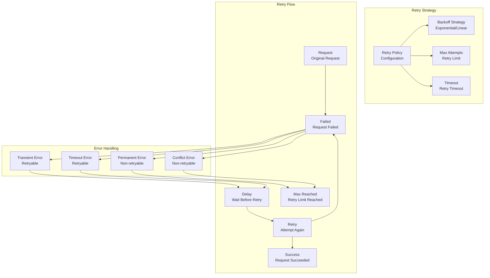
```mermaid
graph TB
    subgraph "Retry Strategy"
        POLICY[Retry Policy<br/>Configuration]
        BACKOFF[Backoff Strategy<br/>Exponential/Linear]
        MAX_ATTEMPTS[Max Attempts<br/>Retry Limit]
        TIMEOUT[Timeout<br/>Retry Timeout]
    end

    subgraph "Retry Flow"
        REQUEST[Request<br/>Original Request]
        FAILED[Failed<br/>Request Failed]
        DELAY[Delay<br/>Wait Before Retry]
        RETRY[Retry<br/>Attempt Again]
        SUCCESS[Success<br/>Request Succeeded]
        MAX_REACHED[Max Reached<br/>Retry Limit Reached]
    end

    subgraph "Error Handling"
        TRANSIENT[Transient Error<br/>Retryable]
        PERMANENT[Permanent Error<br/>Non-retryable]
        TIMEOUT_ERROR[Timeout Error<br/>Retryable]
        CONFLICT_ERROR[Conflict Error<br/>Non-retryable]
    end

    POLICY --> BACKOFF
    POLICY --> MAX_ATTEMPTS
    POLICY --> TIMEOUT

    REQUEST --> FAILED
    FAILED --> TRANSIENT
    TRANSIENT --> DELAY
    DELAY --> RETRY
    RETRY --> SUCCESS
    RETRY --> FAILED
    FAILED --> PERMANENT
    PERMANENT --> MAX_REACHED
    FAILED --> TIMEOUT_ERROR
    TIMEOUT_ERROR --> DELAY
    FAILED --> CONFLICT_ERROR
    CONFLICT_ERROR --> MAX_REACHED
```

#### Implementation Example

```go
// Retry policy configuration
type RetryPolicy struct {
    MaxAttempts     int           `json:"max_attempts" validate:"min=1"`
    InitialDelay    time.Duration `json:"initial_delay" validate:"min=1ms"`
    MaxDelay       time.Duration `json:"max_delay" validate:"min=1ms"`
    Multiplier     float64       `json:"multiplier" validate:"min=1"`
    Jitter         float64       `json:"jitter" validate:"min=0,max=1"`
    Strategy       string        `json:"strategy" validate:"one_of=exponential linear constant"`
    Timeout        time.Duration `json:"timeout" validate:"min=1ms"`
}

// Retry predicate for error-specific logic
type RetryPredicate func(error) bool

// Default retry predicates
func IsRetryableError(err error) bool {
    // Network errors
    if _, ok := err.(net.Error); ok {
        return true
    }

    // Temporary database errors
    if strings.Contains(err.Error(), "connection") {
        return true
    }

    // Timeout errors
    if strings.Contains(err.Error(), "timeout") {
        return true
    }

    // Conflict errors (optimistic locking)
    if strings.Contains(err.Error(), "conflict") {
        return false
    }

    return false
}

// Retry context with predicate
type RetryContext struct {
    Policy    RetryPolicy
    Predicate RetryPredicate
}

func (r *RetryContext) Execute(fn func() error) error {
    var lastErr error

    for attempt := 1; attempt <= r.Policy.MaxAttempts; attempt++ {
        // Execute function
        err := fn()
        if err == nil {
            return nil
        }

        lastErr = err

        // Check if error is retryable
        if !r.Predicate(err) {
            return err
        }

        // Check timeout
        if time.Since(startTime) > r.Policy.Timeout {
            return fmt.Errorf("timeout exceeded: %w", lastErr)
        }

        // Calculate delay
        delay := r.calculateDelay(attempt, err)
        time.Sleep(delay)
    }

    return fmt.Errorf("max retries exceeded: %w", lastErr)
}

func (r *RetryContext) calculateDelay(attempt int, err error) time.Duration {
    switch r.Policy.Strategy {
    case "exponential":
        return r.exponentialDelay(attempt, err)
    case "linear":
        return r.linearDelay(attempt, err)
    case "constant":
        return r.constantDelay(attempt, err)
    default:
        return r.exponentialDelay(attempt, err)
    }
}
```

### 2. Circuit Breaker Pattern

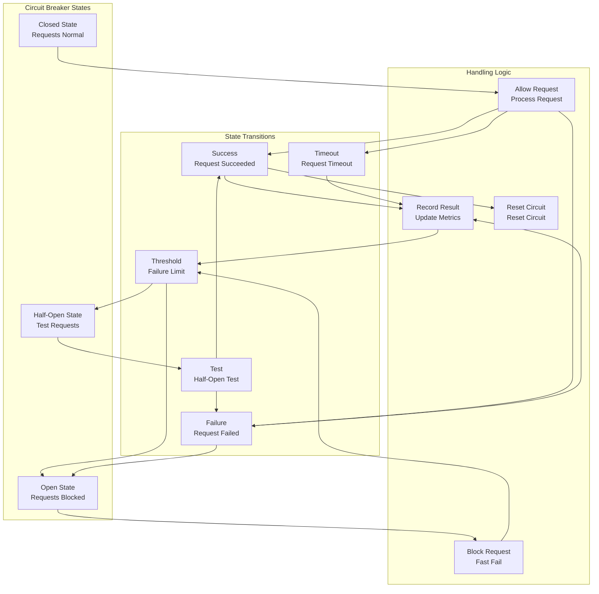
```mermaid
graph TB
    subgraph "Circuit Breaker States"
        CLOSED[Closed State<br/>Requests Normal]
        OPEN[Open State<br/>Requests Blocked]
        HALF_OPEN[Half-Open State<br/>Test Requests]
    end

    subgraph "State Transitions"
        SUCCESS[Success<br/>Request Succeeded]
        FAILURE[Failure<br/>Request Failed]
        TIMEOUT[Timeout<br<arg_value>
Request Timeout]
        THRESHOLD[Threshold<br/>Failure Limit]
        TEST[Test<br/>Half-Open Test]
    end

    subgraph "Handling Logic"
        ALLOW[Allow Request<br/>Process Request]
        BLOCK[Block Request<br/>Fast Fail]
        RECORD[Record Result<br<arg_value>
Update Metrics]
        RESET[Reset Circuit<br/>Reset Circuit]
    end

    CLOSED --> ALLOW
    ALLOW --> SUCCESS
    ALLOW --> FAILURE
    ALLOW --> TIMEOUT
    SUCCESS --> RECORD
    FAILURE --> RECORD
    TIMEOUT --> RECORD
    RECORD --> THRESHOLD
    THRESHOLD --> OPEN
    OPEN --> BLOCK
    BLOCK --> THRESHOLD
    THRESHOLD --> HALF_OPEN
    HALF_OPEN --> TEST
    TEST --> SUCCESS
    TEST --> FAILURE
    SUCCESS --> RESET
    FAILURE --> OPEN
```

#### Implementation Example

```go
// Circuit breaker states
type CircuitState int

const (
    StateClosed CircuitState = iota
    StateOpen
    StateHalfOpen
)

// Circuit breaker implementation
type CircuitBreaker struct {
    state        CircuitState
    failureThreshold int
    resetTimeout   time.Duration
    failures      int
    lastFailure    time.Time
    mutex         sync.RWMutex
}

func (c *CircuitBreaker) Execute(fn func() error) error {
    c.mutex.RLock()
    state := c.state
    c.mutex.RUnlock()

    if state == StateOpen {
        if time.Since(c.lastFailure) > c.resetTimeout {
            c.setState(StateHalfOpen)
        } else {
            return ErrCircuitOpen
        }
    }

    // Execute the function
    err := fn()

    if err != nil {
        c.recordFailure()
    } else {
        c.recordSuccess()
    }

    return err
}

func (c *CircuitBreaker) recordFailure() {
    c.mutex.Lock()
    defer c.mutex.Unlock()

    c.failures++
    c.lastFailure = time.Now()

    if c.failures >= c.failureThreshold {
        c.setState(StateOpen)
    }
}

func (c *CircuitBreaker) recordSuccess() {
    c.mutex.Lock()
    defer c.mutex.Unlock()

    if c.state == StateHalfOpen {
        c.setState(StateClosed)
    }

    c.failures = 0
}

func (c *CircuitBreaker) setState(state CircuitState) {
    c.mutex.Lock()
    defer c.mutex.Unlock()

    c.state = state
    c.failures = 0

    if state == StateOpen {
        c.lastFailure = time.Now()
    }
}
```

### 3. Bulkhead Pattern

```mermaid
graph TB
    subgraph "Bulkhead Pattern"
        SERVICE_1[Service 1<br/>Resource Pool 1]
        SERVICE_2[Service 2<br/>Resource Pool 2]
        SERVICE_3[Service 3<br/>Resource Pool 3]
    end

    subgraph "Resource Management"
        THREAD_POOL[Thread Pool<br/>Concurrent Execution]
        CONNECTION_POOL[Connection Pool<br/>Database Connections]
        MEMORY_POOL[Memory Pool<br/>Memory Management]
    end

    subgraph "Isolation"
        ISOLATION_1[Isolation 1<br/>Service 1 Isolation]
        ISOLATION_2[Isolation 2<br/>Service 2 Isolation]
        ISOLATION_3[Isolation 3<br/>Service 3 Isolation]
    end

    subgraph "Failure Containment"
        LIMIT_1[Limit 1<br/>Resource Limit 1]
        LIMIT_2[Limit 2<br/>Resource Limit 2]
        LIMIT_3[Limit 3<br/>Resource Limit 3]
    end

    SERVICE_1 --> THREAD_POOL
    SERVICE_2 --> THREAD_POOL
    SERVICE_3 --> THREAD_POOL

    THREAD_POOL --> CONNECTION_POOL
    CONNECTION_POOL --> MEMORY_POOL

    SERVICE_1 --> ISOLATION_1
    SERVICE_2 --> ISOLATION_2
    SERVICE_3 --> ISOLATION_3

    ISOLATION_1 --> LIMIT_1
    ISOLATION_2 --> LIMIT_2
    ISOLATION_3 --> LIMIT_3
```

#### Implementation Example

```go
// Bulkhead implementation for goroutine management
type Bulkhead struct {
    maxConcurrent int
    maxWait       time.Duration
    semaphore     chan struct{}
    waitSemaphore chan struct{}
    mutex         sync.Mutex
    activeCount   int
}

func NewBulkhead(maxConcurrent int, maxWait time.Duration) *Bulkhead {
    return &Bulkhead{
        maxConcurrent: maxConcurrent,
        maxWait:       maxWait,
        semaphore:     make(chan struct{}, maxConcurrent),
        waitSemaphore: make(chan struct{}, 1),
    }
}

func (b *Bulkhead) Execute(fn func() error) error {
    // Try to acquire a semaphore slot
    select {
    case b.semaphore <- struct{}{}:
        // Acquired slot, execute function
        return b.executeWithSlot(fn)
    case <-time.After(b.maxWait):
        // Timeout waiting for slot
        return ErrBulkheadTimeout
    }
}

func (b *Bulkhead) executeWithSlot(fn func() error) error {
    b.mutex.Lock()
    b.activeCount++
    b.mutex.Unlock()

    defer func() {
        <-b.semaphore
        b.mutex.Lock()
        b.activeCount--
        b.mutex.Unlock()
    }()

    return fn()
}

// Usage with database connections
type DatabaseBulkhead struct {
    bulkhead *Bulkhead
    db       *gorm.DB
}

func (d *DatabaseBulkhead) Execute(fn func(*gorm.DB) error) error {
    return d.bulkhead.Execute(func() error {
        return fn(d.db)
    })
}
```

## Security Architecture

### 1. Authentication and Authorization

```mermaid
graph TB
    subgraph "Security Architecture"
        AUTH_REQUEST[Auth Request<br/>Authentication Request]
        AUTH_SERVICE[Auth Service<br/>Authentication Logic]
        JWT_HANDLER[JWT Handler<br/>Token Processing]
        AUTHORIZER[Authorizer<br/>Authorization Logic]
        DECISION[Decision<br<arg_value>
Access Control]
    end

    subgraph "Authentication Components"
        CREDENTIALS[Credentials<br/>User Credentials]
        TOKEN[JWT Token<br/>Access Token]
        REFRESH_TOKEN[Refresh Token<br<arg_value>
Token Refresh]
        VALIDATION[Validation<br/>Token Validation]
    end

    subgraph "Authorization Components"
        ROLES[Roles<br/>User Roles]
        PERMISSIONS[Permissions<br/>Access Permissions]
        POLICIES[Policies<br/>Authorization Policies]
        CONTEXT[Context<br/>Request Context]
    end

    subgraph "Security Features"
        RATE_LIMIT[Rate Limiting<br/>Request Throttling]
        CORS[CORS Protection<br/>Cross-origin Security]
        INPUT_VALIDATION[Input Validation<br/>Security Validation]
        LOGGING[Security Logging<br/>Audit Trail]
    end

    AUTH_REQUEST --> AUTH_SERVICE
    AUTH_SERVICE --> CREDENTIALS
    AUTH_SERVICE --> TOKEN
    TOKEN --> REFRESH_TOKEN
    REFRESH_TOKEN --> VALIDATION
    VALIDATION --> JWT_HANDLER
    JWT_HANDLER --> AUTHORIZER
    AUTHORIZER --> ROLES
    AUTHORIZER --> PERMISSIONS
    AUTHORIZER --> POLICIES
    POLICIES --> CONTEXT
    CONTEXT --> DECISION

    AUTH_REQUEST --> RATE_LIMIT
    AUTH_REQUEST --> CORS
    AUTH_REQUEST --> INPUT_VALIDATION
    AUTH_REQUEST --> LOGGING
```

#### Implementation Example

```go
// JWT authentication middleware
type JWTMiddleware struct {
    config     JWTConfig
    extractor  TokenExtractor
    validator  *jwt.Parser
}

func (m *JWTMiddleware) Handle(next echo.HandlerFunc) echo.HandlerFunc {
    return func(c echo.Context) error {
        // Extract JWT token
        token, err := m.extractor.Extract(c)
        if err != nil {
            return c.JSON(http.StatusUnauthorized, ErrorResponse{
                Code:    "UNAUTHORIZED",
                Message: "Authentication token required",
            })
        }

        // Parse and validate token
        parsedToken, err := m.validator.ParseWithClaims(token, &Claims{}, func(token *jwt.Token) (interface{}, error) {
            return []byte(m.config.Secret), nil
        })

        if err != nil {
            return c.JSON(http.StatusUnauthorized, ErrorResponse{
                Code:    "UNAUTHORIZED",
                Message: "Invalid authentication token",
            })
        }

        // Set user context
        c.Set("user", parsedToken.Claims.(*Claims))

        return next(c)
    }
}

// Authorization middleware
type AuthorizationMiddleware struct {
    rolePermissions map[string][]string
    policyEvaluator PolicyEvaluator
}

func (m *AuthorizationMiddleware) Handle(next echo.HandlerFunc) echo.HandlerFunc {
    return func(c echo.Context) error {
        user := c.Get("user").(*Claims)
        requiredRole := c.Param("role")

        // Check if user has required role
        if !m.hasRole(user.Roles, requiredRole) {
            return c.JSON(http.StatusForbidden, ErrorResponse{
                Code:    "FORBIDDEN",
                Message: "Insufficient permissions",
            })
        }

        return next(c)
    }
}

func (m *AuthorizationMiddleware) hasRole(userRoles []string, requiredRole string) bool {
    for _, role := range userRoles {
        if role == requiredRole {
            return true
        }
    }
    return false
}
```

### 2. Input Validation and Sanitization

```mermaid
graph TB
    subgraph "Input Processing"
        RAW_INPUT[Raw Input<br/>User Input]
        VALIDATION[Validation<br/>Input Validation]
        SANITIZATION[Sanitization<br/>Input Cleaning]
        SECURITY_CHECK[Security Check<br/>Security Validation]
    end

    subgraph "Validation Rules"
        REQUIRED[Required Fields<br/>Mandatory Fields]
        FORMAT[Format Validation<br/>Email, Phone, etc.]
        LENGTH[Length Validation<br/>Min/Max Length]
        TYPE[Type Validation<br<arg_value>
Data Type]
        BUSINESS[Business Rules<br/>Business Logic]
    end

    subgraph "Security Checks"
        XSS[XSS Prevention<br/>Cross-site Scripting]
        SQL_INJECTION[SQL Injection<br/>SQL Injection Prevention]
        COMMAND_INJECTION[Command Injection<br/>Command Injection Prevention]
        CSRF[CSRF Protection<br<arg_value>
Cross-site Request Forgery]
    end

    subgraph "Output Processing"
        SAFE_OUTPUT[Safe Output<br/>Clean Output]
        ESCAPING[HTML Escaping<br/>HTML Escaping]
        ENCODING[Output Encoding<br<arg_value>
Output Encoding]
    end

    RAW_INPUT --> VALIDATION
    VALIDATION --> SANITIZATION
    SANITIZATION --> SECURITY_CHECK
    SECURITY_CHECK --> SAFE_OUTPUT

    VALIDATION --> REQUIRED
    VALIDATION --> FORMAT
    VALIDATION --> LENGTH
    VALIDATION --> TYPE
    VALIDATION --> BUSINESS

    SECURITY_CHECK --> XSS
    SECURITY_CHECK --> SQL_INJECTION
    SECURITY_CHECK --> COMMAND_INJECTION
    SECURITY_CHECK --> CSRF

    SAFE_OUTPUT --> ESCAPING
    SAFE_OUTPUT --> ENCODING
```

#### Implementation Example

```go
// Input validation and sanitization
type InputValidator struct {
    validator *validator.Validate
    sanitizer *bleach.Cleaner
}

func (v *InputValidator) ValidateAndSanitize(input map[string]interface{}) (map[string]interface{}, error) {
    // Validate input structure
    if err := v.validator.Struct(input); err != nil {
        return nil, fmt.Errorf("validation failed: %w", err)
    }

    // Sanitize input
    sanitized := make(map[string]interface{})
    for key, value := range input {
        sanitizedValue := v.sanitizeValue(value)
        sanitized[key] = sanitizedValue
    }

    return sanitized, nil
}

func (v *InputValidator) sanitizeValue(value interface{}) interface{} {
    switch v := value.(type) {
    case string:
        // Remove XSS
        cleaned := v.sanitizeHTML()
        // Escape HTML
        escaped := html.EscapeString(cleaned)
        return escaped
    case map[string]interface{}:
        result := make(map[string]interface{})
        for k, val := range v {
            result[k] = v.sanitizeValue(val)
        }
        return result
    case []interface{}:
        result := make([]interface{}, len(v))
        for i, val := range v {
            result[i] = v.sanitizeValue(val)
        }
        return result
    default:
        return value
    }
}

func (s string) sanitizeHTML() string {
    // Remove potentially dangerous HTML tags
    allowed := bleach.DefaultAllowed
    bleach.Sanitize(allowed, s)
    return s
}

// SQL injection prevention
func (q *Query) sanitizeSQL(input string) string {
    // Remove SQL injection patterns
    dangerousPatterns := []string{
        "'", ";", "--", "/*", "*/",
        "xp_", "sp_", "exec", "execute",
        "drop", "delete", "insert", "update",
        "alter", "create", "modify",
    }

    sanitized := input
    for _, pattern := range dangerousPatterns {
        sanitized = strings.ReplaceAll(sanitized, pattern, "")
    }

    return sanitized
}
```

### 3. Security Configuration

```mermaid
 graph TB
    subgraph "Security Configuration"
        SECURITY_CONFIG[Security Config<br/>Security Settings]
        TLS_CONFIG[TLS Configuration<br/>Encryption Settings]
        JWT_CONFIG[JWT Configuration<br/>Token Settings]
        CORS_CONFIG[CORS Configuration<br/>Cross-origin Settings]
        RATE_LIMIT_CONFIG[Rate Limit Config<br/>Throttling Settings]
    end

    subgraph "Security Features"
        HTTPS[HTTPS/TLS<br/>Encryption]
        JWT[JWT Tokens<br/>Authentication]
        CORS[CORS<br/>Cross-origin Protection]
        RATE_LIMIT[Rate Limiting<br/>Request Throttling]
        SECURITY_HEADERS[Security Headers<br/>HTTP Headers]
    end

    subgraph "Security Validation"
        CONFIG_VALIDATION[Config Validation<br/>Security Validation]
        SECURITY_CHECKS[Security Checks<br/>Security Audit]
        COMPLIANCE[Compliance<br<arg_value>
Security Standards]
    end

    SECURITY_CONFIG --> TLS_CONFIG
    SECURITY_CONFIG --> JWT_CONFIG
    SECURITY_CONFIG --> CORS_CONFIG
    SECURITY_CONFIG --> RATE_LIMIT_CONFIG

    TLS_CONFIG --> HTTPS
    JWT_CONFIG --> JWT
    CORS_CONFIG --> CORS
    RATE_LIMIT_CONFIG --> RATE_LIMIT

    SECURITY_CONFIG --> SECURITY_HEADERS

    SECURITY_CONFIG --> CONFIG_VALIDATION
    CONFIG_VALIDATION --> SECURITY_CHECKS
    SECURITY_CHECKS --> COMPLIANCE
```

#### Implementation Example

```go
// Security configuration
type SecurityConfig struct {
    TLS       TLSConfig       `mapstructure:"tls" validate:"required"`
    JWT       JWTConfig       `mapstructure:"jwt" validate:"required"`
    CORS      CORSConfig      `mapstructure:"cors" validate:"required"`
    RateLimit RateLimitConfig `mapstructure:"rate_limit" validate:"required"`
}

// TLS configuration
type TLSConfig struct {
    Enabled  bool   `mapstructure:"enabled" validate:"required"`
    CertFile string `mapstructure:"cert_file" validate:"required_if=Enabled,true"`
    KeyFile  string `mapstructure:"key_file" validate:"required_if=Enabled,true"`
    MinTLS   string `mapstructure:"min_tls" validate:"one_of=1.2 1.3"`
}

// JWT configuration
type JWTConfig struct {
    Secret        string        `mapstructure:"secret" validate:"required"`
    Algorithm     string        `mapstructure:"algorithm" validate:"one_of=HS256 RS256"`
    Expiry        time.Duration `mapstructure:"expiry" validate:"required,min=1s"`
    RefreshExpiry time.Duration `mapstructure:"refresh_expiry" validate:"min=1s"`
    Issuer        string        `mapstructure:"issuer"`
    Audience      string        `mapstructure:"audience"`
}

// CORS configuration
type CORSConfig struct {
    AllowedOrigins     []string `mapstructure:"allowed_origins" validate:"required,min=1"`
    AllowedMethods     []string `mapstructure:"allowed_methods" validate:"required,min=1"`
    AllowedHeaders     []string `mapstructure:"allowed_headers" validate:"required,min=1"`
    ExposedHeaders     []string `mapstructure:"exposed_headers"`
    AllowCredentials   bool     `mapstructure:"allow_credentials"`
    MaxAge             int      `mapstructure:"max_age" validate:"min=0"`
}

// Rate limit configuration
type RateLimitConfig struct {
    Enabled        bool          `mapstructure:"enabled" validate:"required"`
    Requests       int           `mapstructure:"requests" validate:"required,min=1"`
    Window         time.Duration `mapstructure:"window" validate:"required,min=1s"`
    Burst          int           `mapstructure:"burst" validate:"min=1"`
    Cleanup        time.Duration `mapstructure:"cleanup" validate:"min=1s"`
}

// Security middleware
type SecurityMiddleware struct {
    securityConfig *SecurityConfig
    limiter        *RateLimiter
}

func (m *SecurityMiddleware) Setup(e *echo.Echo) {
    // Setup CORS
    e.Use(m.corsMiddleware())

    // Setup security headers
    e.Use(m.securityHeadersMiddleware())

    // Setup rate limiting
    if m.securityConfig.RateLimit.Enabled {
        e.Use(m.rateLimitMiddleware())
    }

    // Setup JWT
    if m.securityConfig.JWT.Secret != "" {
        e.Use(jwtMiddleware(m.securityConfig.JWT))
    }
}

func (m *SecurityMiddleware) securityHeadersMiddleware() echo.MiddlewareFunc {
    return func(next echo.HandlerFunc) echo.HandlerFunc {
        return func(c echo.Context) error {
            // Security headers
            c.Response().Header().Set("X-Content-Type-Options", "nosniff")
            c.Response().Header().Set("X-Frame-Options", "DENY")
            c.Response().Header().Set("X-XSS-Protection", "1; mode=block")
            c.Response().Header().Set("Strict-Transport-Security", "max-age=31536000; includeSubDomains")
            c.Response().Header().Set("Content-Security-Policy", "default-src 'self'")

            return next(c)
        }
    }
}
```

## Observability Architecture

### 1. Logging Architecture

```mermaid
 graph TB
    subgraph "Logging Architecture"
        LOG_REQUESTS[Request Logging<br/>HTTP Request Logging]
        LOG_ERRORS[Error Logging<br/>Error Handling]
        LOG_PERFORMANCE[Performance Logging<br/>Performance Metrics]
        LOG_SECURITY[Security Logging<br/>Security Events]
    end

    subgraph "Log Processing"
        STRUCTURED_LOGGING[Structured Logging<br/>JSON Format]
        LOG_LEVELS[Log Levels<br/>Debug, Info, Error]
        LOG_FORMATTERS[Log Formatters<br/>Format Output]
        LOG_WRITERS[Log Writers<br<arg_value>
Output Destinations]
    end

    subgraph "Log Output"
        CONSOLE[Console Output<br/>Development]
        FILE[File Output<br/>Production]
        SYSLOG[Syslog Output<br<arg_value>
System Logs]
        REMOTE[Remote Logging<br/>Centralized Logs]
    end

    LOG_REQUESTS --> STRUCTURED_LOGGING
    LOG_ERRORS --> STRUCTURED_LOGGING
    LOG_PERFORMANCE --> STRUCTURED_LOGGING
    LOG_SECURITY --> STRUCTURED_LOGGING

    STRUCTURED_LOGGING --> LOG_LEVELS
    STRUCTURED_LOGGING --> LOG_FORMATTERS
    STRUCTURED_LOGGING --> LOG_WRITERS

    LOG_FORMATTERS --> CONSOLE
    LOG_FORMATTERS --> FILE
    LOG_FORMATTERS --> SYSLOG
    LOG_FORMATTERS --> REMOTE
```

#### Implementation Example

```go
// Structured logging implementation
type StructuredLogger struct {
    logger *zap.Logger
    config LogConfig
}

func (l *StructuredLogger) LogRequest(c echo.Context, duration time.Duration) {
    l.logger.Info("HTTP request",
        zap.String("method", c.Request().Method),
        zap.String("path", c.Request().URL.Path),
        zap.String("remote_addr", c.Request().RemoteAddr),
        zap.String("user_agent", c.Request().UserAgent()),
        zap.Int("status", c.Response().Status),
        zap.Duration("duration", duration),
        zap.String("request_id", c.Get("request_id").(string)),
    )
}

func (l *StructuredLogger) LogError(err error, context map[string]interface{}) {
    l.logger.Error("Error occurred",
        zap.Error(err),
        zap.Any("context", context),
    )
}

func (l *StructuredLogger) LogPerformance(operation string, duration time.Duration) {
    l.logger.Info("Performance metric",
        zap.String("operation", operation),
        zap.Duration("duration", duration),
    )
}

// Request ID middleware
func RequestIDMiddleware(next echo.HandlerFunc) echo.HandlerFunc {
    return func(c echo.Context) error {
        // Generate or retrieve request ID
        requestID := c.Request().Header.Get("X-Request-ID")
        if requestID == "" {
            requestID = generateRequestID()
        }

        // Set request ID in context
        c.Set("request_id", requestID)
        c.Response().Header().Set("X-Request-ID", requestID)

        return next(c)
    }
}
```

### 2. Metrics Architecture

```mermaid
 graph TB
    subgraph "Metrics Collection"
        HTTP_METRICS[HTTP Metrics<br/>Request Metrics]
        BUSINESS_METRICS[Business Metrics<br/>Application Metrics]
        SYSTEM_METRICS[System Metrics<br/>System Performance]
        SECURITY_METRICS[Security Metrics<br/>Security Events]
    end

    subgraph "Metric Types"
        COUNTER[Counter<br/>Incremental Values]
        GAUGE[Gauge<br/>Current Values]
        HISTOGRAM[Histogram<br<arg_value>
Distribution Values]
        SUMMARY[Summary<br/>Statistical Values]
    end

    subgraph "Metric Export"
        PROMETHEUS[Prometheus<br/>Metrics Collection]
        GRAFANA[Grafana<br<arg_value>
Visualization]
        ALERTING[Alerting<br/>Alerting Rules]
        DASHBOARD[Dashboard<br/>Monitoring]
    end

    HTTP_METRICS --> COUNTER
    HTTP_METRICS --> GAUGE
    HTTP_METRICS --> HISTOGRAM

    BUSINESS_METRICS --> COUNTER
    BUSINESS_METRICS --> GAUGE
    BUSINESS_METRICS --> HISTOGRAM

    SYSTEM_METRICS --> GAUGE
    SYSTEM_METRICS --> SUMMARY

    SECURITY_METRICS --> COUNTER
    SECURITY_METRICS --> HISTOGRAM

    COUNTER --> PROMETHEUS
    GAUGE --> PROMETHEUS
    HISTOGRAM --> PROMETHEUS
    SUMMARY --> PROMETHEUS

    PROMETHEUS --> GRAFANA
    GRAFANA --> ALERTING
    GRAFANA --> DASHBOARD
```

#### Implementation Example

```go
// Metrics registry
type MetricsRegistry struct {
    registry   *prometheus.Registry
    counters   map[string]*prometheus.CounterVec
    gauges     map[string]*prometheus.GaugeVec
    histograms map[string]*prometheus.HistogramVec
    mutex     sync.RWMutex
}

func (r *MetricsRegistry) IncCounter(name string, labels map[string]string) {
    r.mutex.RLock()
    defer r.mutex.RUnlock()

    if counter, exists := r.counters[name]; exists {
        counter.With(labels).Inc()
    }
}

func (r *MetricsRegistry) ObserveHistogram(name string, value float64, labels map[string]string) {
    r.mutex.RLock()
    defer r.mutex.RUnlock()

    if histogram, exists := r.histograms[name]; exists {
        histogram.With(labels).Observe(value)
    }
}

// HTTP metrics middleware
func HTTPMetricsMiddleware(registry *MetricsRegistry) echo.MiddlewareFunc {
    return func(next echo.HandlerFunc) echo.HandlerFunc {
        return func(c echo.Context) error {
            start := time.Now()

            // Process request
            err := next(c)

            // Record metrics
            duration := time.Since(start).Seconds()
            status := strconv.Itoa(c.Response().Status)

            labels := map[string]string{
                "method": c.Request().Method,
                "path":   c.Request().URL.Path,
                "status": status,
            }

            registry.IncCounter("http_requests_total", labels)
            registry.ObserveHistogram("http_request_duration_seconds", duration, labels)

            return err
        }
    }
}
```

### 3. Health Check Architecture

```mermaid
 graph TB
    subgraph "Health Check System"
        REGISTRY[Health Registry<br/>Health Check Registry]
        LIVE[Liveness Probe<br<arg_value>
Application Health]
        READY[Readiness Probe<br/>Service Health]
        STARTUP[Startup Probe<br/>Application Startup]
    end

    subgraph "Health Check Types"
        DATABASE_CHECK[Database Check<br/>Database Connection]
        REDIS_CHECK[Redis Check<br/>Redis Connection]
        EXTERNAL_CHECK[External Check<br/>Dependency Health]
        CUSTOM_CHECK[Custom Check<br/>Business Logic]
    end

    subgraph "Health Check Execution"
        CONCURRENT_EXECUTION[Concurrent Execution<br/>Performance]
        TIMEOUT_HANDLING[Timeout Handling<br/>Timeout Management]
        ERROR_HANDLING[Error Handling<br/>Error Management]
        AGGREGATION[Result Aggregation<br/>Health Status]
    end

    subgraph "Health Check Output"
        HEALTH_ENDPOINT[Health Endpoint<br/>HTTP Endpoint]
        METRICS[Metrics<br/>Health Metrics]
        ALERTING[Alerting<br/>Health Alerts]
        MONITORING[Monitoring<br/>Health Monitoring]
    end

    REGISTRY --> LIVE
    REGISTRY --> READY
    REGISTRY --> STARTUP

    LIVE --> DATABASE_CHECK
    LIVE --> REDIS_CHECK
    LIVE --> EXTERNAL_CHECK
    LIVE --> CUSTOM_CHECK

    DATABASE_CHECK --> CONCURRENT_EXECUTION
    REDIS_CHECK --> CONCURRENT_EXECUTION
    EXTERNAL_CHECK --> CONCURRENT_EXECUTION
    CUSTOM_CHECK --> CONCURRENT_EXECUTION

    CONCURRENT_EXECUTION --> TIMEOUT_HANDLING
    TIMEOUT_HANDLING --> ERROR_HANDLING
    ERROR_HANDLING --> AGGREGATION

    AGGREGATION --> HEALTH_ENDPOINT
    AGGREGATION --> METRICS
    AGGREGATION --> ALERTING
    AGGREGATION --> MONITORING
```

#### Implementation Example

```go
// Health check interface
type HealthChecker interface {
    Check(ctx context.Context) HealthCheck
}

// Health check implementation
type DatabaseHealthChecker struct {
    database *gorm.DB
}

func (d *DatabaseHealthChecker) Check(ctx context.Context) HealthCheck {
    start := time.Now()

    // Ping database
    err := d.database.WithContext(ctx).Exec("SELECT 1").Error

    duration := time.Since(start)

    if err != nil {
        return HealthCheck{
            Name:     "database",
            Status:   HealthStatusUnhealthy,
            Message:  fmt.Sprintf("Database connection failed: %s", err.Error()),
            Duration: duration,
        }
    }

    return HealthCheck{
        Name:     "database",
        Status:   HealthStatusHealthy,
        Message:  "Database connection successful",
        Duration: duration,
    }
}

// Health check registry
type HealthRegistry struct {
    checks  map[string]HealthChecker
    mutex  sync.RWMutex
}

func (r *HealthRegistry) Register(name string, check HealthChecker) {
    r.mutex.Lock()
    defer r.mutex.Unlock()
    r.checks[name] = check
}

func (r *HealthRegistry) ExecuteChecks(ctx context.Context) []HealthCheck {
    r.mutex.RLock()
    defer r.mutex.Unlock()

    results := make([]HealthCheck, 0, len(r.checks))

    for name, check := range r.checks {
        result := check.Check(ctx)
        result.Name = name
        results = append(results, result)
    }

    return results
}

// HTTP health check handler
func HealthCheckHandler(registry *HealthRegistry) echo.HandlerFunc {
    return func(c echo.Context) error {
        ctx := c.Request().Context()

        // Execute health checks
        checks := registry.ExecuteChecks(ctx)

        // Determine overall status
        overallStatus := HealthStatusHealthy
        unhealthyCount := 0

        for _, check := range checks {
            if check.Status == HealthStatusUnhealthy {
                unhealthyCount++
                overallStatus = HealthStatusUnhealthy
            } else if check.Status == HealthStatusWarning && overallStatus == HealthStatusHealthy {
                overallStatus = HealthStatusWarning
            }
        }

        // Prepare response
        response := HealthCheckResponse{
            Status: overallStatus,
            Checks: checks,
            Timestamp: time.Now(),
        }

        // Set HTTP status code
        statusCode := http.StatusOK
        if overallStatus == HealthStatusUnhealthy {
            statusCode = http.StatusServiceUnavailable
        } else if overallStatus == HealthStatusWarning {
            statusCode = http.StatusPartialContent
        }

        return c.JSON(statusCode, response)
    }
}
```

## Deployment Architecture

### 1. Container Architecture

```mermaid
 graph TB
    subgraph "Container Architecture"
        MAIN_CONTAINER[Main Container<br/>Application Container]
        SUPPORT_CONTAINER[Support Container<br/>Database Container]
        CACHE_CONTAINER[Cache Container<br/>Redis Container]
        QUEUE_CONTAINER[Queue Container<br<arg_value>
Message Queue Container]
    end

    subgraph "Container Orchestration"
        KUBERNETES[Kubernetes<br/>Orchestration]
        DOCKER_COMPOSE[Docker Compose<br/>Local Development]
        SWARM[Docker Swarm<br<arg_value>
Container Orchestration]
    end

    subgraph "Container Configuration"
        DOCKERFILE[Dockerfile<br/>Container Build]
        IMAGE[Image<br/>Container Image]
        NETWORK[Network<br<arg_value>
Container Network]
        VOLUMES[Volumes<br/>Persistent Storage]
    end

    subgraph "Deployment Configuration"
        DEPLOYMENT[Deployment<br/>Deployment Config]
        SERVICE[Service<br/>Service Configuration]
        INGRESS[Ingress<br/>Load Balancing]
        CONFIGMAP[ConfigMap<br<arg_value>
Configuration]
    end

    MAIN_CONTAINER --> KUBERNETES
    SUPPORT_CONTAINER --> KUBERNETES
    CACHE_CONTAINER --> KUBERNETES
    QUEUE_CONTAINER --> KUBERNETES

    KUBERNETES --> DOCKERFILE
    KUBERNETES --> IMAGE
    KUBERNETES --> NETWORK
    KUBERNETES --> VOLUMES

    IMAGE --> DEPLOYMENT
    DEPLOYMENT --> SERVICE
    SERVICE --> INGRESS
    CONFIGMAP --> DEPLOYMENT
```

#### Implementation Example

```dockerfile
# Dockerfile for Go application
FROM golang:1.23-alpine AS builder

WORKDIR /app
COPY go.mod go.sum ./
RUN go mod download

COPY . .
RUN CGO_ENABLED=0 GOOS=linux go build -a -installsuffix cgo -o main ./cmd/main

FROM alpine:latest
RUN apk --no-cache add ca-certificates
WORKDIR /root/

COPY --from=builder /app/main .
COPY --from=builder /app/config ./config

EXPOSE 8080
CMD ["./main"]
```

```yaml
# Kubernetes deployment configuration
apiVersion: apps/v1
kind: Deployment
metadata:
  name: govern-app
  labels:
    app: govern
spec:
  replicas: 3
  selector:
    matchLabels:
      app: govern
  template:
    metadata:
      labels:
        app: govern
    spec:
      containers:
      - name: govern
        image: govern:latest
        ports:
        - containerPort: 8080
        env:
        - name: CONFIG_PATH
          value: "/config/config.yaml"
        resources:
          requests:
            memory: "64Mi"
            cpu: "250m"
          limits:
            memory: "128Mi"
            cpu: "500m"
        livenessProbe:
          httpGet:
            path: /health/liveness
            port: 8080
          initialDelaySeconds: 30
          periodSeconds: 10
        readinessProbe:
          httpGet:
            path: /health/readiness
            port: 8080
          initialDelaySeconds: 5
          periodSeconds: 5
```

### 2. Configuration Management

```mermaid
 graph TB
    subgraph "Configuration Management"
        CONFIG_FILES[Config Files<br/>Configuration Files]
        ENV_VARS[Environment Variables<br/>Environment Configuration]
        SECRETS[Secrets<br/>Secret Management]
        CONFIG_MAP[Config Map<br/>Configuration Mapping]
    end

    subgraph "Configuration Sources"
        LOCAL_CONFIG[Local Config<br/>Development Config]
        REMOTE_CONFIG[Remote Config<br/>Production Config]
        DYNAMIC_CONFIG[Dynamic Config<br<arg_value>
Runtime Config]
        FEATURE_FLAGS[Feature Flags<br/>Feature Configuration]
    end

    subgraph "Configuration Processing"
        MERGER[Configuration Merger<br/>Configuration Merge]
        VALIDATOR[Configuration Validator<br/>Configuration Validation]
        WATCHER[Configuration Watcher<br<arg_value>
Configuration Monitoring]
        REFRESH[Configuration Refresh<br/>Configuration Update]
    end

    subgraph "Configuration Usage"
        APPLICATION[Application<br/>Runtime Application]
        SERVICES[Services<br<arg_value>
Service Configuration]
        MIDDLEWARE[Middleware<br/>Middleware Configuration]
        COMPONENTS[Components<br/>Component Configuration]
    end

    CONFIG_FILES --> MERGER
    ENV_VARS --> MERGER
    SECRETS --> MERGER
    CONFIG_MAP --> MERGER

    LOCAL_CONFIG --> CONFIG_FILES
    REMOTE_CONFIG --> CONFIG_FILES
    DYNAMIC_CONFIG --> CONFIG_FILES
    FEATURE_FLAGS --> CONFIG_FILES

    MERGER --> VALIDATOR
    VALIDATOR --> WATCHER
    WATCHER --> REFRESH

    REFRESH --> APPLICATION
    REFRESH --> SERVICES
    REFRESH --> MIDDLEWARE
    REFRESH --> COMPONENTS
```

#### Implementation Example

```yaml
# Kubernetes config map
apiVersion: v1
kind: ConfigMap
metadata:
  name: govern-config
data:
  config.yaml: |
    server:
      port: 8080
      read_timeout: 30s
      write_timeout: 30s
      tls:
        enabled: false
        cert_file: ""
        key_file: ""

    database:
      host: "postgres-service"
      port: 5432
      user: "govern"
      password: ""
      database: "govern"
      max_open_conns: 100
      max_idle_conns: 25
      conn_max_lifetime: 5m

    redis:
      addr: "redis-service:6379"
      password: ""
      db: 0
      pool_size: 100
      min_idle_conns: 10

    log:
      level: "info"
      format: "json"
      output: "stdout"

    metrics:
      enabled: true
      path: "/metrics"
```

```go
// Configuration manager
type ConfigManager struct {
    config   *config.Config
    watcher  *config.Watcher
    validator *config.Validator
}

func (m *ConfigManager) LoadConfiguration() error {
    // Load configuration from multiple sources
    viper.SetConfigName("config")
    viper.SetConfigType("yaml")
    viper.AddConfigPath("/etc/govern")
    viper.AddConfigPath("$HOME/.govern")
    viper.AddConfigPath(".")

    // Set default values
    viper.SetDefault("server.port", 8080)
    viper.SetDefault("server.read_timeout", "30s")
    viper.SetDefault("server.write_timeout", "30s")

    // Load configuration
    if err := viper.ReadInConfig(); err != nil {
        return fmt.Errorf("failed to read configuration: %w", err)
    }

    // Unmarshal configuration
    if err := viper.Unmarshal(&m.config); err != nil {
        return fmt.Errorf("failed to unmarshal configuration: %w", err)
    }

    // Validate configuration
    if err := m.validator.Validate(m.config); err != nil {
        return fmt.Errorf("configuration validation failed: %w", err)
    }

    return nil
}

func (m *ConfigManager) WatchConfiguration() error {
    // Watch for configuration changes
    watcher, err := fsnotify.NewWatcher()
    if err != nil {
        return err
    }

    // Watch configuration files
    if err := watcher.Add("/etc/govern"); err != nil {
        return err
    }

    // Start watcher
    go func() {
        for {
            select {
            case event, ok := <-watcher.Events:
                if !ok {
                    return
                }
                if event.Op&fsnotify.Write == fsnotify.Write {
                    m.reloadConfiguration()
                }
            case err, ok := <-watcher.Errors:
                if !ok {
                    return
                }
                log.Printf("Configuration watcher error: %v", err)
            }
        }
    }()

    m.watcher = watcher
    return nil
}
```

### 3. Monitoring and Alerting

```mermaid
 graph TB
    subgraph "Monitoring Stack"
        PROMETHEUS[Prometheus<br/>Metrics Collection]
        GRAFANA[Grafana<br/>Visualization]
        ALERTMANAGER[AlertManager<br/>Alerting]
        LOKI[Loki<br/>Log Aggregation]
    end

    subgraph "Alerting Configuration"
        ALERT_RULES[Alert Rules<br/>Alert Conditions]
        NOTIFICATION_CHANNELS[Notification Channels<br/>Alert Delivery]
        ESCALATION_POLICIES[Escalation Policies<br<arg_value>
Alert Escalation]
        ALERT_SILENCING[Alert Silencing<br/>Alert Management]
    end

    subgraph "Monitoring Dashboards"
        SYSTEM_DASHBOARD[System Dashboard<br/>System Health]
        APPLICATION_DASHBOARD[Application Dashboard<br/>Application Metrics]
        BUSINESS_DASHBOARD[Business Dashboard<br/>Business Metrics]
        SECURITY_DASHBOARD[Security Dashboard<br/>Security Metrics]
    end

    subgraph "Alert Types"
        CRITICAL_ALERTS[Critical Alerts<br/>Urgent Issues]
        WARNING_ALERTS[Warning Alerts<br/>Non-urgent Issues]
        INFO_ALERTS[Info Alerts<br/>Informational]
        BUSINESS_ALERTS[Business Alerts<br/>Business Events]
    end

    PROMETHEUS --> ALERT_RULES
    GRAFANA --> DASHBOARDS
    ALERTMANAGER --> NOTIFICATION_CHANNELS
    LOKI --> LOG_ALERTS

    ALERT_RULES --> CRITICAL_ALERTS
    ALERT_RULES --> WARNING_ALERTS
    ALERT_RULES --> INFO_ALERTS
    ALERT_RULES --> BUSINESS_ALERTS

    CRITICAL_ALERTS --> ESCALATION_POLICIES
    WARNING_ALERTS --> ESCALATION_POLICIES
    INFO_ALERTS --> ALERT_SILENCING
    BUSINESS_ALERTS --> NOTIFICATION_CHANNELS

    DASHBOARDS --> SYSTEM_DASHBOARD
    DASHBOARDS --> APPLICATION_DASHBOARD
    DASHBOARDS --> BUSINESS_DASHBOARD
    DASHBOARDS --> SECURITY_DASHBOARD
```

#### Implementation Example

```yaml
# Prometheus alert rules
groups:
- name: govern_alerts
  rules:
  - alert: HighErrorRate
    expr: rate(http_requests_total{status=~"5.."}[5m]) > 0.1
    for: 5m
    labels:
      severity: critical
    annotations:
      summary: "High error rate detected"
      description: "Error rate is {{ $value }} errors per second"

  - alert: HighResponseTime
    expr: histogram_quantile(0.95, rate(http_request_duration_seconds_bucket[5m])) > 1
    for: 5m
    labels:
      severity: warning
    annotations:
      summary: "High response time detected"
      description: "95th percentile response time is {{ $value }} seconds"

  - alert: DatabaseConnectionErrors
    expr: rate(database_errors_total[5m]) > 0.01
    for: 5m
    labels:
      severity: critical
    annotations:
      summary: "Database connection errors detected"
      description: "Database error rate is {{ $value }} errors per second"
```

```yaml
# Grafana dashboard configuration
apiVersion: 1
datasources:
- name: Prometheus
  type: prometheus
  access: proxy
  orgId: 1
  url: http://prometheus:9090
  basicAuth: false
  isDefault: true
  version: 1
  editable: false

dashboards:
- name: Govern System Dashboard
  orgId: 1
  folder: ""
  type: file
  options:
    path: /etc/grafana/provisioning/dashboards/govern-system.json
  version: 1
  refresh: 30s

- name: Govern Application Dashboard
  orgId: 1
  folder: ""
  type: file
  options:
    path: /etc/grafana/provisioning/dashboards/govern-application.json
  version: 1
  refresh: 30s
```

## Summary

The Govern project architecture provides a comprehensive foundation for building production-ready HTTP services in Go. The architecture follows clean design principles with clear separation of concerns, comprehensive error handling, and extensive observability.

### Key Architectural Benefits

1. **Modularity**: Clean separation of concerns with focused, single-purpose modules
2. **Scalability**: Designed for horizontal scaling with stateless application design
3. **Reliability**: Comprehensive error handling, retry mechanisms, and graceful shutdown
4. **Observability**: Built-in logging, metrics, and health monitoring
5. **Security**: Authentication, authorization, and input validation
6. **Performance**: Optimized for production with connection pooling and efficient algorithms

### Technology Integration

The architecture integrates seamlessly with modern DevOps practices:
- **Containerization**: Docker and Kubernetes support
- **Monitoring**: Prometheus and Grafana integration
- **Logging**: Structured logging with Zap
- **Configuration**: Flexible configuration management with Viper
- **Orchestration**: Kubernetes deployment ready

### Future Extensibility

The architecture is designed to be extensible:
- **Microservices**: Ready for microservices architecture
- **Multi-tenancy**: Support for multi-tenant applications
- **Advanced Features**: Circuit breakers, service discovery, distributed tracing
- **New Frameworks**: Easy integration with additional web frameworks

### Best Practices

The architecture follows Go best practices:
- **Interface-based design**: For flexibility and testability
- **Error handling**: Comprehensive error handling with structured error codes
- **Testing**: Comprehensive test coverage with unit and integration tests
- **Documentation**: Extensive documentation and examples
- **Security**: Security-first design with authentication and authorization

The Govern project provides a solid foundation for building modern, scalable, and maintainable HTTP services in Go.

---

*Last Updated: March 9, 2026*
*Version: 1.0.0*